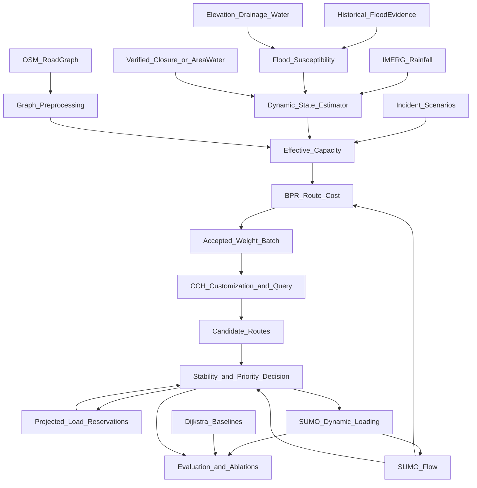

# Project Research and Evidence

**Prepared for faculty review**  
**Project location:** Chennai, Tamil Nadu, India  
**Evidence cutoff:** 3 September 2026  
**Document status:** Research-backed project definition and roadmap; it does not claim that planned components are implemented.

> **Evidence rule used throughout this document**
>
> - **Implemented** means working code exists in this repository.
> - **Planned** means supported by research but not yet implemented.
> - **Observed** means obtained from a measurement or recorded event.
> - **Historical** does not mean current.
> - **Derived** means calculated by this project.
> - **Simulated** does not mean live Chennai traffic.

## Recommended Project Title

**Capacity-Aware, Stability-Controlled Routing under Flood and Traffic Disruptions: A Chennai Case Study**

### Alternative Titles

1. **Dynamic Routing under Compound Flood and Traffic Disruptions in Chennai**
2. **A Reproducible Chennai Framework for Flood-, Incident-, and Congestion-Aware Routing**
3. **Evaluating Customizable Road Routing under Chennai Monsoon Disruptions**
4. **Stability-Aware Route Guidance for Flood-Disrupted Urban Traffic in Chennai**

### Why This Title Was Chosen

The title identifies the real contribution without claiming a new shortest-path algorithm or guaranteed real-time deployment. “Capacity-aware” reflects the common mechanism through which flooding and incidents affect roads. “Stability-controlled” identifies the planned protection against unnecessary route switching and herding. “Case study” correctly limits conclusions to the selected Chennai network and evidence.

## Executive Project Overview

### Problem Statement

Ordinary route planning assumes that road conditions are sufficiently stable while a trip is being planned. During Chennai monsoon events, this assumption can fail: rainfall and waterlogging may reduce road usability, incidents may remove lanes, and diverted vehicles may overload the remaining alternatives. A route that was reasonable earlier can become slow or unsafe, while immediate rerouting of every vehicle can itself create congestion and oscillation.

### Motivation

Chennai has recurring monsoon and flood disruption, heterogeneous traffic, incomplete public road-level traffic measurements, and a mix of historical, satellite, weather, and infrastructure data. Existing Chennai studies cover flood mapping, flood forecasting, relief routing, traffic simulation, and time-dependent route planning, but the reviewed literature provides limited evidence of their integration into one transparent capacity-based, stability-aware routing evaluation.

### Objective

Develop and evaluate a reproducible routing framework that:

- translates flood and incident evidence into road availability or effective capacity;
- uses traffic flow and effective capacity to estimate travel time;
- updates routes after meaningful network changes rather than continuously;
- limits unnecessary route switching and projected overload on alternatives;
- supports a separately evaluated emergency-routing scenario; and
- is compared fairly against the existing Dijkstra proof of concept.

### Proposed Solution

Use open Chennai geospatial and rainfall data to estimate road condition, use calibrated BPR travel-time estimates for route choice, use SUMO for dynamic traffic loading and realized outcomes, and use **Customizable Contraction Hierarchies (CCH)** as the conditional primary routing engine. CCH is selected because Chennai's road topology is relatively stable while its travel-time weights change. Dijkstra remains a baseline. ALT-guided bidirectional A* is the dependency-light backup.

### Expected Outcome

The expected result is not an operational navigation application. It is a tested research framework, reproducible scenarios, and evidence showing when the proposed system improves route computation, disruption avoidance, route stability, and network outcomes—and when it does not.

## Current Project Status

### Already Implemented

The repository contains a working Stage 1 proof of concept:

- a small Chennai driving graph downloaded from OpenStreetMap through OSMnx;
- OpenCity Chennai 2015 historical flood-hotspot KML acquisition and provenance;
- CRS-safe projection and nearest-road mapping;
- `NORMAL` and controlled `BLOCKED` road states;
- effective-capacity calculation;
- BPR travel-time calculation;
- NetworkX Dijkstra before and after one controlled blockage;
- CSV, JSON, GraphML, and PNG outputs;
- tests for CRS handling, flood-to-road mapping, capacity/BPR behavior, blocked-edge avoidance, and route change.

**Dijkstra is currently used in the Stage 1 proof of concept and is retained as a baseline; the researched final routing engine is conditional CCH and has not been implemented.**

The last reported run loaded 327 historical points and found a real mapped edge whose blockage forced a detour. Its generated outputs are ignored by Git and are not preserved on this branch, so this is handoff evidence rather than an independently inspectable frozen artifact. That count and route are not guaranteed invariants because the remote OSM/OpenCity inputs are mutable.

Stage 1 demonstrates flood-point mapping and avoidance of a controlled hard closure. Because every normal edge receives the same \(x/c=0.5\), its finite BPR multiplier scales free-flow costs uniformly; Stage 1 does **not** yet validate congestion-sensitive route choice or calibrated capacity effects.

### Currently Being Refined

- final project framing and defensible novelty;
- routing-engine feasibility and benchmark design;
- factor selection and source/licence verification;
- study-area definition;
- separation of BPR-estimated route cost from SUMO-realized travel time;
- projected-load and rerouting-stability policy.

### Planned

- robust Chennai graph with stable arc IDs and explicit missing-data handling;
- historical susceptibility features from flood, elevation, and drainage evidence;
- IMERG rainfall ingestion;
- dynamic road-condition rules with confidence and expiry;
- per-edge traffic flow from SUMO or permitted observations;
- incident capacity changes;
- CCH preprocessing/customization/query adapter;
- threshold, hysteresis, cooldown, and rerouting batches;
- emergency scenario;
- full baseline, ablation, sensitivity, and statistical evaluation.

### Not Implemented

There is currently no live rainfall pipeline, current flood detector, SRTM/drainage model, accident stream, SUMO integration, dynamic rerouting loop, CCH engine, emergency-routing logic, traffic-signal preemption, or city-wide evaluation. Stub files exist for several later components, but a stub is not an implementation.

## Final Problem Definition

The final system operates on a directed Chennai road graph \(G=(V,E)\). The topology changes rarely, but the state of edge \(e\) changes at update time \(t\):

\[
z_{e,t} =
\left(
x_{e,t},
c^0_e,
s^{flood}_{e,t},
s^{incident}_{e,t},
q_{e,t}
\right)
\]

where:

- \(x_{e,t}\) is observed or simulated flow;
- \(c^0_e\) is baseline capacity;
- \(s^{flood}_{e,t}\) is the inferred flood-related state;
- \(s^{incident}_{e,t}\) is incident/lane availability;
- \(q_{e,t}\) records confidence, source age, and quality.

The routing cost is updated only after accepted state changes. The system must respond to:

- local closures or severe flood evidence;
- broader capacity degradation;
- changing traffic flow;
- incidents;
- stale or missing evidence;
- route degradation significant enough to justify a change; and
- projected load caused by the system's own recommendations.

This differs from static shortest-path routing because both road feasibility and travel-time weights can change between route decisions, while route changes must be controlled at fleet/network level.

The first final-system version remains a **snapshot-dynamic** system: it updates scalar edge costs between routing epochs. It will not be called formally time-dependent unless edge cost becomes a function of edge-entry time \(w_e(\tau)\) inside one query.

### Effective-Capacity Definition

For declared time interval \(\Delta t\), baseline capacity \(c^0_e\) and assigned entering demand \(x_{e,t}\) must use matching units (for example passenger-car-equivalent vehicles/hour). Compound disruptions use bounded multiplicative factors:

\[
c^{eff}_{e,t} =
\begin{cases}
0, & \text{if a verified closure or impassable state applies},\\
\max(c^{min}_e,\;c^0_e\,m^{flood}_{e,t}m^{incident}_{e,t}), & \text{otherwise},
\end{cases}
\]

where each multiplier lies in \((0,1]\), \(c^{min}_e\) prevents division by numerical zero for a passable road, and simultaneous flood/incident effects are capped by the documented lower bound. If one observed effect already includes the other, the model uses a joint multiplier rather than multiplying twice. Free-flow speed reduction is modelled separately only when calibrated, to avoid counting one flood effect in both \(t^0\) and capacity.

## Factors Used by the Final System

### Road Topology and Free-Flow Travel Time

**What it represents:** Directed roads, intersections, length, road class, one-way status, and baseline traversal time.  
**Why it matters:** Every environmental and traffic state must be attached to a routable road segment.  
**Source:** OpenStreetMap through OSMnx.  
**Observed / Historical / Derived / Predicted:** Current mutable map snapshot plus derived travel time.  
**How it is calculated:** Preserve edge geometry and length; use mapped speed where available and documented class-based fallback otherwise.  
**Where it enters the system:** Base graph and \(t^0_e\).  
**How it affects routing:** Defines feasible connections and the lower-bound travel cost.  
**Evidence from literature:** OSM-based routing is established; [Ganguly and Roy (2017)](https://doi.org/10.1109/ICT-DM.2017.8275694) used OSM for Chennai flood relief routing.  
**Limitations:** Missing lanes, speeds, turn restrictions, service roads, and grade separation require validation.

### Baseline Road Capacity

**What it represents:** Approximate vehicles per unit time that an edge can carry under normal conditions.  
**Why it matters:** BPR and incident/flood degradation require compatible flow and capacity units.  
**Source:** OSM road class/lanes where present; transparent literature/configuration defaults otherwise.  
**Observed / Historical / Derived / Predicted:** Derived/model parameter until calibrated.  
**How it is calculated:** Class- and lane-sensitive lookup with provenance; never one silent city-wide constant in the final model.  
**Where it enters the system:** \(c^0_e\).  
**How it affects routing:** Lower capacity raises \(x/c\) and estimated travel time.  
**Evidence from literature:** Capacity-based assignment and BPR are standard; engineered CCH has been used for traffic assignment ([Buchhold et al., 2019](https://doi.org/10.1145/3362693)).  
**Limitations:** OSM completeness and mixed Chennai traffic make calibration necessary.

### Traffic Flow and Congestion

**What it represents:** Current/projected use of each road.  
**Why it matters:** A road can be physically open but slow, and rerouted vehicles can overload alternatives.  
**Source:** SUMO in the reproducible core; optional licensed traffic APIs only for validation/extensions.  
**Observed / Historical / Derived / Predicted:** Simulated in the core; projected within a rerouting batch.  
**How it is calculated:** Assigned entering demand over a declared interval is converted to vehicles/hour or passenger-car-equivalent flow consistent with capacity units. Discharged throughput alone is not used as demand because it can decrease after queues form; SUMO queue/occupancy and realized travel time are retained as separate congestion outcomes.  
**Where it enters the system:** BPR \(x_{e,t}/c^{eff}_{e,t}\) and projected-load allocation.  
**How it affects routing:** Raises travel-time estimates and changes later assignments.  
**Evidence from literature:** Dynamic traffic assignment and route-guidance feedback are established; routing apps can create oscillation ([Bianchin and Pasqualetti](https://doi.org/10.1109/OJCSYS.2024.3397270)).  
**Limitations:** SUMO is not live Chennai traffic; results depend on demand and behavioral calibration.

### Historical Flood Susceptibility

**What it represents:** Relative tendency of an edge's surroundings to experience flooding.  
**Why it matters:** The same rainfall does not affect all roads equally.  
**Source:** OpenCity historical flood layers, SRTM/NASADEM, drains, canals, and water bodies.  
**Observed / Historical / Derived / Predicted:** Derived from historical/static evidence.  
**How it is calculated:** Transparent normalized features such as nearby historical observations, hazard-zone intersection, elevation/slope, and drainage context.  
**Where it enters the system:** Static prior for dynamic road-state estimation.  
**How it affects routing:** Increases the likelihood/severity assigned under rainfall; it is not directly added as arbitrary minutes.  
**Evidence from literature:** Chennai flood vulnerability and ML susceptibility are established ([Ahmed and Kranthi, 2018](https://doi.org/10.17485/ijst/2018/v11i6/110831); [Alabdan et al., 2025](https://doi.org/10.1038/s41598-025-08912-4)).  
**Limitations:** It is neither current inundation nor a calibrated probability unless validation supports that interpretation.

### Recent Rainfall and Accumulation

**What it represents:** Area rainfall forcing over recent 30-minute, 3-hour, and 6-hour windows.  
**Why it matters:** Recent and accumulated rainfall can activate risk at susceptible locations.  
**Source:** NASA GPM IMERG; IMD/OpenWeather only as optional supporting services.  
**Observed / Historical / Derived / Predicted:** Satellite-estimated rainfall; rolling accumulations are derived.  
**How it is calculated:** Extract relevant 0.1° cells, retain product/run/time, and compute rolling sums with missing-data flags.  
**Where it enters the system:** Dynamic flood-state estimator.  
**How it affects routing:** Can move susceptible edges from normal toward degraded/severe, subject to calibration and corroboration.  
**Evidence from literature:** IMERG has been used in Chennai flood research and operationally relevant forecasting.  
**Limitations:** Roughly 10 km cells and several-hour Early latency cannot identify a flooded street.

### Current Flood or Closure Evidence

**What it represents:** Time-stamped evidence that water or an authority/citizen report affects an area/road.  
**Why it matters:** Direct evidence should override a weak susceptibility-only inference.  
**Source:** Verified authority closures/reports when available; optional Chennai Flood DSS display, Sentinel-1, or OPERA DSWx as area-level evidence.  
**Observed / Historical / Derived / Predicted:** Observed at source acquisition/report time, with confidence and expiry.  
**How it is calculated:** Spatial intersection/buffering with road geometry, preserving source time, resolution, confidence, and grade-separation checks.  
**Where it enters the system:** Road-state escalation or hard closure.  
**How it affects routing:** Reduces capacity or removes an edge.  
**Evidence from literature:** Chennai crowdsourced and Sentinel flood mapping exist ([Naik, 2016](https://doi.org/10.1109/SYSENG.2016.7753186); [Vanama and Rao, 2019](https://doi.org/10.1109/IGARSS.2019.8899282)).  
**Limitations:** No dependable open live road-closure API was verified; satellite observations are intermittent and too coarse for many streets.

### Incident and Lane Availability

**What it represents:** A scripted accident, closure, or unavailable lane.  
**Why it matters:** Flood and non-flood disruptions can occur together.  
**Source:** Reproducible scripted SUMO scenarios; optional licensed incident feeds.  
**Observed / Historical / Derived / Predicted:** Simulated in the core.  
**How it is calculated:** Documented duration and lane/edge capacity multiplier or closure.  
**Where it enters the system:** \(c^{eff}_{e,t}\) and edge availability.  
**How it affects routing:** Raises \(x/c\) or removes an edge without adding an arbitrary incident score.  
**Evidence from literature:** Incident-capacity and ambulance routing are established ([Luan and Jiang, 2024](https://doi.org/10.1371/journal.pone.0301637)).  
**Limitations:** Scripted incidents cannot be described as real Chennai events.

### Evidence Quality and Freshness

**What it represents:** Age, resolution, provenance, missingness, and confidence of each state input.  
**Why it matters:** A stale flood report or delayed satellite scene should not indefinitely block a road.  
**Source:** Metadata from every input.  
**Observed / Historical / Derived / Predicted:** Derived quality state.  
**How it is calculated:** Source-specific expiry, missing-data rule, confidence class, and update version.  
**Where it enters the system:** State transition and fallback logic.  
**How it affects routing:** Weak/stale evidence may degrade cautiously; verified closures can block immediately.  
**Evidence from literature:** Flood mapping and social-media studies explicitly report uncertainty and urban limitations.  
**Limitations:** Confidence rules require sensitivity testing and cannot manufacture ground truth.

### Route Stability and Projected Rerouting Load

**What it represents:** Cost of changing instructions and additional demand caused by accepted routes.  
**Why it matters:** Independent shortest paths can create herding and oscillation.  
**Source:** Current route, new candidate routes, SUMO flow, accepted assignments, and policy parameters.  
**Observed / Historical / Derived / Predicted:** Derived/projected.  
**How it is calculated:** Degradation threshold, minimum improvement, cooldown, shared-route change, rerouting-batch size, and provisional flow reservations.  
**Where it enters the system:** Decision layer above the path engine.  
**How it affects routing:** Suppresses marginal changes and diversifies/limits assignments to an apparently cheap alternative.  
**Evidence from literature:** Bounded rationality and oscillatory route guidance are established; a 2026 field study used bounded, limited rerouting ([Nature Cities](https://doi.org/10.1038/s44284-026-00443-x)).  
**Limitations:** This is an approximation, not proof of user or system equilibrium.

### Vehicle/Service Priority

**What it represents:** Whether a request is emergency response, essential service, or normal traffic.  
**Why it matters:** Emergency response time can be evaluated separately from average traffic performance.  
**Source:** Simulation scenario configuration, not private live ambulance data.  
**Observed / Historical / Derived / Predicted:** Experimental class.  
**How it is calculated:** Lexicographic policy: safety feasibility first, then emergency deadline/arrival time, then bounded disruption to others.  
**Where it enters the system:** Query order, feasible edge set, and allocation policy.  
**How it affects routing:** Emergency requests are considered first but cannot use blocked roads; normal users retain a bounded-delay protection.  
**Evidence from literature:** Emergency routing is well established, including EMVLight ([Su et al.](https://doi.org/10.1016/j.trc.2022.103955)).  
**Limitations:** Route priority is not signal preemption. This factor is a secondary evaluation scenario, not the headline novelty.

### Factor Summary

| Factor                    | Why It Matters                     | Data Source                         | Data Type            | How Derived                    | Where Used         | Evidence                      |
| ------------------------- | ---------------------------------- | ----------------------------------- | -------------------- | ------------------------------ | ------------------ | ----------------------------- |
| Road graph/free flow      | Defines feasible movement          | OSM/OSMnx                           | Map snapshot/derived | Geometry, length, speed        | Topology, \(t^0\)  | Ganguly & Roy 2017            |
| Baseline capacity         | Connects road form to congestion   | OSM + assumptions                   | Derived              | Class/lane lookup              | \(c^0\)            | BPR/assignment literature     |
| Traffic flow              | Represents congestion and feedback | SUMO                                | Simulated/projected  | Interval counts                | BPR/allocation     | DTA literature                |
| Flood susceptibility      | Differentiates rainfall response   | OpenCity + SRTM + hydrology         | Historical/derived   | Transparent feature score      | Flood-state prior  | Chennai vulnerability studies |
| Rainfall                  | Dynamic environmental forcing      | IMERG                               | Satellite estimate   | 30-min/3-h/6-h sums            | State estimator    | NASA product evidence         |
| Flood/closure observation | Escalates or blocks roads          | Verified reports; optional SAR/DSWx | Observed             | Spatial/time/confidence join   | Road condition     | Chennai mapping studies       |
| Incident                  | Models non-flood disruption        | SUMO scripts                        | Experimental         | Capacity/closure event         | Effective capacity | Incident-routing literature   |
| Evidence quality          | Prevents stale certainty           | Source metadata                     | Derived              | Expiry/confidence              | State transitions  | Data-quality limitations      |
| Stability/projected load  | Limits churn and herding           | Routes + flow                       | Derived/projected    | Trigger/hysteresis/reservation | Decision layer     | Stability literature          |
| Service priority          | Tests emergency response trade-off | Scenario config                     | Experimental         | Lexicographic class policy     | Query/allocation   | Emergency-routing literature  |

### Factors Considered but Rejected

- **Air quality/emissions as route weights:** useful as an evaluation outcome, but it dilutes the compound-disruption question and has sparse station coverage.
- **Pothole/computer-vision detection:** unrelated to the validated flood-capacity research question and would require a separate data/model contribution.
- **Raw elevation as a flood flag:** rejected because low elevation is susceptibility evidence, not current flooding.
- **Rainfall as direct road closure:** rejected because IMERG is much coarser than a road.
- **Custom satellite flood deep learning:** rejected from the core because Sen1Floods11 has no Chennai event and unresolved official licensing, STURM-Flood requires a separate ML scope, and road-level validation remains weak.
- **VIP/private-vehicle priority:** no public-interest or research justification.
- **Traffic-signal preemption:** no open Chennai SPaT/controller feed or implementation access; route priority must not imply signal control.
- **End-to-end reinforcement learning:** rejected as the primary engine because Chennai training data, safety guarantees, explainability, and field validation are insufficient.
- **Arbitrary flood/incident penalties:** rejected in favor of availability, speed, and effective-capacity effects with physical units.

## Dataset and Data-Source Evidence

### Dataset: OpenStreetMap Road Data

**Classification:** Primary Project Input  
**Provider:** OpenStreetMap contributors / OpenStreetMap Foundation  
**Purpose:** Routable road topology and geometry.  
**What the dataset contains:** Vector nodes, ways, relations, road class, directionality, and incomplete speed/lanes/turn attributes.  
**Geographic coverage:** Global.  
**Chennai coverage:** Yes; local completeness must be audited.  
**Temporal coverage:** Continuously edited database; historical snapshots are possible.  
**Spatial resolution:** Vector data, not a raster resolution.  
**Temporal resolution:** Snapshot at retrieval time.  
**Update frequency:** Main database/replication continuously updated; downstream services may lag.  
**File/API format:** OSM XML/PBF; Overpass responses; OSMnx `MultiDiGraph`; GraphML output.  
**Access method:** OSMnx/Overpass without a key for reasonable use; cache the graph.  
**License:** Open Database License 1.0; attribution and applicable share-alike obligations. OSMnx software is MIT.  
**Free/Open status:** Free/open data; public endpoints are rate-limited infrastructure.  
**How our project uses it:** **Current:** Stage 1 creates a small directed graph. **Planned:** attach stable IDs, validated attributes, and all dynamic states/costs.  
**Limitations:** Community completeness, missing traffic attributes, and incomplete turn/grade information.

**Direct Dataset / Data Portal:** [Geofabrik India extract](https://download.geofabrik.de/asia/india.html)  
**Official Documentation:** [OSM copyright and licence](https://www.openstreetmap.org/copyright)  
**Interactive Viewer / Map:** [OpenStreetMap](https://www.openstreetmap.org/#map=11/13.083/80.271)  
**Repository / Code:** [OSMnx](https://github.com/gboeing/osmnx)  
**Supporting Paper / Evidence:** [Boeing, OSMnx](https://doi.org/10.1016/j.compenvurbsys.2017.05.004)

#### What You Can Verify

The map link displays Chennai road geometry. Geofabrik provides downloadable India PBF extracts. The licence page explains reuse obligations, and the OSMnx repository exposes the software used by Stage 1.

### Dataset: OpenCity Chennai Flooding Data

**Classification:** Primary Historical Evidence  
**Provider:** OpenCity catalogue; resources credit GCC/Chennai flood systems and contributors.  
**Purpose:** Chennai-specific historical inundation and hazard evidence.  
**What the dataset contains:** KML inundation points with depth, 2015 flood points, hazard classes, and 5–200-year return-period layers.  
**Geographic coverage:** Chennai/GCC and related basin areas depending on resource.  
**Chennai coverage:** Direct.  
**Temporal coverage:** Historical events and modelled return-period hazards.  
**Spatial resolution:** Mixed points/vector zones; no common stated accuracy.  
**Temporal resolution:** Event/static, not a stream.  
**Update frequency:** Portal metadata updates do not mean observations are live.  
**File/API format:** KML downloads; CKAN metadata API.  
**Access method:** Direct public download; no key.  
**License:** Check each resource. Stage 1's selected CKAN package reports “Other (Public Domain).”  
**Free/Open status:** Publicly downloadable; preserve source/credit metadata.  
**How our project uses it:** **Current:** Stage 1 maps the selected 2015 hotspot KML to roads. **Planned:** historical susceptibility features and validation.  
**Limitations:** Historical location does not prove present inundation; point methods and dates vary.

**Direct Dataset / Data Portal:** [Chennai Flooding Data](https://data.opencity.in/dataset/chennai-flooding-data)  
**Official Documentation:** [Stage 1 CKAN package API](https://data.opencity.in/api/3/action/package_show?id=chennai-floods-2015-data)  
**Interactive Viewer / Map:** The dataset page provides per-resource previews where supported.  
**Repository / Code:** [Project flood loader](../src/chennai_routing/data/flood.py)  
**Supporting Paper / Evidence:** [Chennai crowdsourced inundation study](https://doi.org/10.1186/s40677-021-00195-x)

#### What You Can Verify

The catalogue lists actual KML resources and descriptions. A professor can open previews or download KML files. The repository code shows the exact resource ID and provenance written by Stage 1.

### Dataset: Chennai Drainage and Water-Body Layers

**Classification:** Supporting Input  
**Provider:** OpenCity mirror; GCC, Chennai Flood DSS, and India-WRIS are cited as underlying sources.  
**Purpose:** Static hydrological context for susceptibility.  
**What the dataset contains:** Storm-water drains for 114 wards, macro/micro drains, rivers/canals, and water-body census points.  
**Geographic coverage:** GCC/Chennai basin; coverage differs by file.  
**Chennai coverage:** Direct but incomplete/inconsistent by layer.  
**Temporal coverage:** Infrastructure snapshots; SWD map is labelled 2023 and water census reflects 2018–19/release 2023.  
**Spatial resolution:** Vector lines/points; positional accuracy and drain attributes are not fully documented.  
**Temporal resolution:** Static.  
**Update frequency:** Irregular catalogue releases.  
**File/API format:** KML/PDF depending on resource.  
**Access method:** Direct public downloads; no key.  
**License:** SWD resource says public domain; water-census metadata contains conflicting non-commercial/public-domain labels. Verify before redistribution.  
**Free/Open status:** Public access, but licence consistency varies.  
**How our project uses it:** **Planned:** distance/density context, permanent-water masking, and susceptibility features.  
**Limitations:** A mapped drain does not prove capacity, connectivity, maintenance, direction, or current operation.

**Direct Dataset / Data Portal:** [Storm-water drains](https://data.opencity.in/dataset/chennai-stormwater-drain-swd-maps)  
**Official Documentation:** [Basin drainage catalogue](https://data.opencity.in/dataset/chennai-basin-drainage-maps)  
**Interactive Viewer / Map:** Resource previews are available on supported OpenCity pages.  
**Repository / Code:** [Hydrology module boundary](../src/chennai_routing/data/hydrology.py)  
**Supporting Paper / Evidence:** [Chennai integrated flood forecasting system — publisher PDF; no DOI was found](https://currentscience.ac.in/Volumes/117/05/0741.pdf)

#### What You Can Verify

The links list downloadable KMLs for drains, rivers, and canals. Resource metadata displays size, source, date, and licence fields; those fields also expose the water-census licence inconsistency.

### Dataset: NASA SRTM / NASADEM

**Classification:** Supporting Input  
**Provider:** NASA/USGS LP DAAC  
**Purpose:** Coarse terrain prior for susceptibility.  
**What the dataset contains:** Elevation/surface-height grids from the February 2000 SRTM mission; NASADEM is reprocessed SRTM.  
**Geographic coverage:** Approximately 60°N–56°S.  
**Chennai coverage:** Yes.  
**Temporal coverage:** One historical acquisition campaign.  
**Spatial resolution:** 1 arc-second, approximately 30 m.  
**Temporal resolution:** Static.  
**Update frequency:** Product reprocessing, not repeated terrain observation.  
**File/API format:** HGT/GeoTIFF-style raster products through Earthdata.  
**Access method:** Free Earthdata Login commonly required.  
**License:** NASA Earth science data generally open under NASA data-use guidance; cite product/version.  
**Free/Open status:** Free.  
**How our project uses it:** **Planned:** relative elevation/slope features, not current flood detection.  
**Limitations:** Surface-height/building/vegetation bias, unresolved underpasses/curbs, and vertical errors significant in flat Chennai.

**Direct Dataset / Data Portal:** [SRTMGL1 V003](https://www.earthdata.nasa.gov/data/catalog/lpcloud-srtmgl1-003)  
**Official Documentation:** [NASA Earthdata data-use guidance](https://www.earthdata.nasa.gov/engage/open-data-services-software-policies/data-use-guidance)  
**Interactive Viewer / Map:** [NASA Earthdata Search](https://search.earthdata.nasa.gov/search?q=SRTMGL1)  
**Repository / Code:** [Elevation module boundary](../src/chennai_routing/data/elevation.py)  
**Supporting Paper / Evidence:** [Ahmed and Kranthi 2018](https://doi.org/10.17485/ijst/2018/v11i6/110831)

#### What You Can Verify

The catalogue shows product coverage, resolution, dates, and access. Earthdata Search displays available tiles after login.

### Dataset: NASA GPM IMERG V07

**Classification:** Primary Project Input  
**Provider:** NASA/JAXA Global Precipitation Measurement mission  
**Purpose:** Reproducible rainfall forcing and accumulation.  
**What the dataset contains:** Multi-satellite precipitation estimates in Early, Late, and gauge-adjusted Final runs.  
**Geographic coverage:** Near-global, including Chennai.  
**Chennai coverage:** Yes; coastal pixels may mix land/sea.  
**Temporal coverage:** V07 research record extends through the TRMM/GPM era; use the exact selected product's catalogue dates.  
**Spatial resolution:** 0.1° (roughly 10 km near Chennai).  
**Temporal resolution:** 30 minutes.  
**Update frequency:** Every half-hour product epoch.  
**File/API format:** HDF5/NetCDF and subset/cloud services depending on product.  
**Access method:** Free Earthdata Login/GES DISC authorization.  
**License:** NASA open-data guidance; cite exact product/version/DOI.  
**Free/Open status:** Free/open scientific data.  
**How our project uses it:** **Planned:** recent rainfall and 3-/6-hour rolling accumulation; Final for historical calibration, Early for delayed near-current experiments.  
**Limitations:** Early latency about four hours, Final latency about 3.5 months, interpolation/retrieval uncertainty, and no street-level flood proof.

**Direct Dataset / Data Portal:** [IMERG data directory](https://gpm.nasa.gov/data/directory)  
**Official Documentation:** [IMERG V07 documentation](https://gpm.nasa.gov/resources/documents/imerg-v07-technical-documentation)  
**Interactive Viewer / Map:** [NASA Giovanni](https://giovanni.gsfc.nasa.gov/giovanni/)  
**Repository / Code:** [Rainfall module boundary](../src/chennai_routing/data/rainfall.py)  
**Supporting Paper / Evidence:** [GPM mission/IMERG overview](https://gpm.nasa.gov/data/imerg)

#### What You Can Verify

The directory identifies Early/Late/Final products and resolutions. Giovanni can visualize/subset rainfall after selecting a product and region. Registration is required for many downloads.

### Dataset/Software: Eclipse SUMO

**Classification:** Experimental Dataset Generator / Simulation Software  
**Provider:** Eclipse Foundation SUMO project  
**Purpose:** Reproducible dynamic traffic, incidents, vehicle classes, and realized travel times.  
**What the dataset contains:** SUMO is software, not observed Chennai data; it produces edge/vehicle simulation outputs from supplied networks and demand.  
**Geographic coverage:** User-defined; OSM Chennai can be imported.  
**Chennai coverage:** Constructed by this project, not bundled.  
**Temporal coverage:** Scenario-defined.  
**Spatial resolution:** Lane/edge network model.  
**Temporal resolution:** User-configurable simulation time step.  
**Update frequency:** Simulation step.  
**File/API format:** SUMO XML, CSV outputs, TraCI/libsumo APIs.  
**Access method:** Free installation/source; no API key.  
**License:** EPL-2.0 with GPL-2.0-or-later secondary conditions for relevant components.  
**Free/Open status:** Open source.  
**How our project uses it:** **Planned:** generate flow, incidents, emergency vehicles, and realized outcomes.  
**Limitations:** Requires Chennai demand/behavior calibration and must always be labelled simulated.

**Direct Dataset / Data Portal:** Not a fixed dataset; [SUMO downloads](https://eclipse.dev/sumo/)  
**Official Documentation:** [SUMO documentation](https://eclipse.dev/sumo/docs/)  
**Interactive Viewer / Map:** SUMO-GUI is installed with SUMO; no web viewer is claimed.  
**Repository / Code:** [Eclipse SUMO repository](https://github.com/eclipse-sumo/sumo)  
**Supporting Paper / Evidence:** [Chennai heterogeneous-traffic calibration](https://doi.org/10.1007/978-981-15-3742-4_13)

#### What You Can Verify

The official site documents microscopic simulation, OSM import, traffic lights, incidents, and TraCI. The Chennai calibration paper demonstrates that local behavior needs calibration rather than default parameters.

### Dataset: Sentinel-1 SAR

**Classification:** Optional Enhancement  
**Provider:** European Union Copernicus programme / ESA  
**Purpose:** Retrospective or near-current area-level flood evidence through clouds/night.  
**What the dataset contains:** C-band SAR Level-1 products; IW GRD is commonly used for flood mapping.  
**Geographic coverage:** Global acquisition programme.  
**Chennai coverage:** Scenes exist; exact event dates must be queried.  
**Temporal coverage:** Archive from 2014 onward.  
**Spatial resolution:** IW GRD about 20×22 m effective resolution with 10 m pixel spacing.  
**Temporal resolution:** Acquisition scenes.  
**Update frequency:** Nominal C/D constellation revisit about six days; actual acquisition and delivery vary.  
**File/API format:** SAFE/GeoTIFF-derived workflows and catalogue APIs.  
**Access method:** Free Copernicus Data Space account.  
**License:** Free, full, open Sentinel-data terms with source notice.  
**Free/Open status:** Free/open.  
**How our project uses it:** **Optional planned use:** event confirmation, never sole road closure.  
**Limitations:** Urban layover/shadow/double bounce, speckle, revisit delay, and road width below reliable detection.

**Direct Dataset / Data Portal:** [Copernicus Data Space Browser](https://browser.dataspace.copernicus.eu/)  
**Official Documentation:** [Sentinel-1 mission](https://sentiwiki.copernicus.eu/web/s1-mission)  
**Interactive Viewer / Map:** [Copernicus Browser](https://browser.dataspace.copernicus.eu/)  
**Repository / Code:** No custom classifier is proposed.  
**Supporting Paper / Evidence:** [Chennai Sentinel-1 flood mapping](https://doi.org/10.1109/IGARSS.2019.8899282)

#### What You Can Verify

The browser allows a registered user to search Chennai by date and inspect available scenes. It displays imagery, not verified road-depth measurements.

### Dataset: NASA OPERA DSWx-S1

**Classification:** Optional Enhancement  
**Provider:** NASA OPERA / PO.DAAC  
**Purpose:** Analysis-ready area-level surface-water classification.  
**What the dataset contains:** 30 m water-classification and confidence GeoTIFFs derived from Sentinel-1.  
**Geographic coverage:** Near-global land.  
**Chennai coverage:** In principle where source acquisition/product exists; verify dates.  
**Temporal coverage:** Forward production from September 2024, with catalogue records beginning around late 2023.  
**Spatial resolution:** 30 m.  
**Temporal resolution:** Acquisition-driven.  
**Update frequency:** Approximately 6–12-day revisit where available.  
**File/API format:** GeoTIFF/MGRS tiles.  
**Access method:** Free Earthdata Login/PO.DAAC.  
**License:** NASA product containing modified Copernicus Sentinel data; preserve both citations.  
**Free/Open status:** Free.  
**How our project uses it:** **Optional planned use:** regional corroboration/retrospective label.  
**Limitations:** Product scope targets open water larger than about 3 ha and 200 m width, excluding most street waterlogging.

**Direct Dataset / Data Portal:** [OPERA DSWx-S1 V1](https://doi.org/10.5067/OPDSWS1-L3V1)  
**Official Documentation:** [OPERA DSWx suite](https://www.jpl.nasa.gov/go/opera/products/dswx-product-suite/)  
**Interactive Viewer / Map:** [NASA Earthdata Search](https://search.earthdata.nasa.gov/search?q=OPERA_L3_DSWX-S1)  
**Repository / Code:** [OPERA validation workflows](https://github.com/OPERA-Cal-Val/DSWx-Requirement-Verification)  
**Supporting Paper / Evidence:** Official PO.DAAC metadata at the dataset DOI.

#### What You Can Verify

The DOI opens official metadata specifying 30 m resolution, revisit, format, and minimum mapped-water scale. Earthdata Search exposes matching granules after login.

### Dataset: India Flood Inventory–Impacts

**Classification:** Supporting Historical Evidence  
**Provider:** IIT Delhi HydroSense Lab in collaboration with IMD  
**Purpose:** Select and contextualize historical Indian flood events.  
**What the dataset contains:** Event records from 1967–2023, district impacts/flooded area, and district severity index.  
**Geographic coverage:** India.  
**Chennai coverage:** Tamil Nadu/Chennai-related events at administrative/event scale.  
**Temporal coverage:** 1967–2023.  
**Spatial resolution:** Mainly district/administrative, not inundation footprints.  
**Temporal resolution:** Event start/end records.  
**Update frequency:** Versioned research releases, not live.  
**File/API format:** CSV/Zenodo files.  
**Access method:** Direct public download; no key.  
**License:** Current Zenodo metadata reports CC BY-NC 4.0.  
**Free/Open status:** Free for attributed non-commercial use.  
**How our project uses it:** **Planned supporting use:** event selection and broad historical validation only.  
**Limitations:** Cannot label Chennai roads or serve as a government operational feed.

**Direct Dataset / Data Portal:** [Zenodo concept/latest record](https://doi.org/10.5281/zenodo.4742142)  
**Official Documentation:** [HydroSense resources](https://hydrosense.iitd.ac.in/resources/)  
**Interactive Viewer / Map:** No official road-level viewer is claimed.  
**Repository / Code:** [India Flood Inventory repository](https://github.com/hydrosenselab/India-Flood-Inventory)  
**Supporting Paper / Evidence:** [Saharia et al., Natural Hazards](https://doi.org/10.1007/s11069-021-04698-6)

#### What You Can Verify

Zenodo displays files, versions, authors, DOI, and licence. The CSV records are historical event data, not water polygons.

### Rejected Benchmark Datasets

| Dataset                                                       | Classification                          | Evidence                                                                                         | Decision                                                                   |
| ------------------------------------------------------------- | --------------------------------------- | ------------------------------------------------------------------------------------------------ | -------------------------------------------------------------------------- |
| [Sen1Floods11](https://doi.org/10.1109/CVPRW50498.2020.00113) | Rejected Source / ML benchmark          | 4,831 chips from 11 events; no Chennai event; maintainer repository has no resolved licence file | Exclude unless separate licence clarification and flood-segmentation study |
| [STURM-Flood](https://doi.org/10.5281/zenodo.12748983)        | Rejected Source / optional ML benchmark | 10 m global event tiles; Chennai inclusion unverified; CC BY 4.0                                 | Exclude from routing core; custom flood ML is separate work                |

## Dataset Classification Summary

| Source                       | Classification                 | Why                                               |
| ---------------------------- | ------------------------------ | ------------------------------------------------- |
| OSM/OSMnx                    | Primary Project Input          | Required topology                                 |
| OpenCity flood layers        | Historical Evidence / Primary  | Chennai-specific flood prior and validation       |
| SRTM/NASADEM                 | Supporting Input               | Coarse static terrain only                        |
| OpenCity drains/water bodies | Supporting Input               | Hydrological context with quality caveats         |
| GPM IMERG                    | Primary Project Input          | Reproducible rainfall forcing                     |
| SUMO                         | Experimental Dataset Generator | Reproducible dynamic traffic/incident environment |
| Sentinel-1                   | Optional Enhancement           | Intermittent area evidence                        |
| OPERA DSWx-S1                | Optional Enhancement           | Easier area-level water product, not street scale |
| India Flood Inventory        | Historical Evidence            | Event context, not roads                          |
| OpenWeather/Open-Meteo       | Optional Live Extension        | Forecast convenience, not core                    |
| Sen1Floods11/STURM-Flood     | Rejected Source for core       | ML scope/domain/licence limitations               |
| Processed edge-state tables  | Derived Dataset                | Reproducible project output                       |

## APIs and Live Data Services

### Required / Core Data Sources

| Provider/service        | Purpose                        | Official access                                                                                    | Cost/authentication                | Geographic/time status           | Reproducibility and fallback                                                                                                            |
| ----------------------- | ------------------------------ | -------------------------------------------------------------------------------------------------- | ---------------------------------- | -------------------------------- | --------------------------------------------------------------------------------------------------------------------------------------- |
| OSM Overpass via OSMnx  | Road snapshot                  | [Overpass API](https://overpass-api.de/) / [OSMnx docs](https://osmnx.readthedocs.io/)             | Free, no key; fair-use/rate limits | Chennai/current mutable map      | Cache graph; a dated Geofabrik PBF is a pinning source only after a separate `osmium`/`pyrosm` import path is implemented and validated |
| OpenCity CKAN           | Flood/drain metadata and files | [CKAN package API](https://data.opencity.in/api/3/action/package_show?id=chennai-floods-2015-data) | Free, no key                       | Historical/static                | Store provenance/checksum; local processed copy                                                                                         |
| NASA Earthdata/GES DISC | IMERG/elevation/OPERA          | [Earthdata Search](https://search.earthdata.nasa.gov/)                                             | Free account/token                 | Global; product-specific latency | Pin product/version/time range                                                                                                          |
| SUMO TraCI              | Simulation state/control       | [TraCI docs](https://eclipse.dev/sumo/docs/TraCI.html)                                             | Free, local; no key                | Simulated                        | Scenario files/seeds are the reproducible source                                                                                        |

### Optional Live Extensions

| Service                  | Purpose                                     | Official documentation                                                                                                 | Free-tier/current status                                                                                                        | Authentication/rate limits                                                | Use and fallback                                                                 |
| ------------------------ | ------------------------------------------- | ---------------------------------------------------------------------------------------------------------------------- | ------------------------------------------------------------------------------------------------------------------------------- | ------------------------------------------------------------------------- | -------------------------------------------------------------------------------- |
| OpenWeather Free         | Current weather + 3-hourly 5-day forecast   | [Pricing](https://openweathermap.org/full-price), [API](https://openweathermap.org/api)                                | Permanent free plan lists 60 calls/min and 1,000,000/month; roughly two-hour source updates                                     | Account/API key                                                           | Optional UI/forecast context; fallback IMERG/Open-Meteo                          |
| OpenWeather One Call 4.0 | Finer forecast/timeline/alerts              | [One Call 4.0](https://openweathermap.org/api/one-call-4), [FAQ](https://openweathermap.org/faq)                       | Separate pay-as-you-call setup; first 1,000 calls/day included, overage charged                                                 | API key and billing setup; cap at 1,000/day                               | Optional only; never required                                                    |
| Open-Meteo               | Forecast-model access                       | [Forecast API](https://open-meteo.com/en/docs), [pricing/licence](https://open-meteo.com/en/pricing)                   | Free no-key non-commercial use with CC BY 4.0 attribution; published open-access limits are 600/min, 5,000/hour, and 10,000/day | No key for public non-commercial endpoint; commercial use requires a plan | Preferred no-friction forecast fallback; preserve model identity and attribution |
| IMD APIs                 | Official warnings, nowcasts, AWS/ARG        | [IMD API reference](https://api.imd.gov.in/public/api_reference.html)                                                  | Public registration; some access requires IP whitelisting; quotas/pricing not uniformly published                               | Registration/authorization                                                | Supporting authority evidence; do not make core depend on approval               |
| Chennai Flood DSS        | Local gauges/water levels/forecast display  | [Public dashboard](https://chennaifloodmonitor.tn.gov.in/HomePage/Dashboard)                                           | Free dashboard; no documented public developer API/reuse licence found                                                          | Browser access                                                            | Manual validation only unless formal feed is granted                             |
| Mappls traffic           | India-native route/traffic/incident service | [REST API repository](https://github.com/mappls-api/mappls-rest-apis)                                                  | Key/account; limited access and commercial terms vary                                                                           | Vendor quota/terms                                                        | Optional validation; SUMO remains reproducible core                              |
| TomTom Traffic           | Flow/incidents                              | [Traffic API docs](https://docs.tomtom.com/traffic-api/documentation/tomtom-maps/v1/product-information/introduction/) | Developer key and plan/free allowance                                                                                           | Vendor limits/licence                                                     | Optional Chennai coverage pilot                                                  |
| HERE Traffic             | Flow/incidents                              | [Traffic API coverage](https://docs.here.com/traffic-api/docs/traffic-here-traffic-api-v7-coverage-information)        | Key/OAuth and plan                                                                                                              | Vendor limits/licence                                                     | Optional; no core dependency                                                     |
| Google Routes            | Traffic-aware route/ETA                     | [Traffic-aware routing](https://developers.google.com/maps/documentation/routes/config_trade_offs)                     | Billing account/API key; India allowances and SKU pricing vary                                                                  | Google terms restrict storage/extraction                                  | Comparator only; cannot create an open traffic dataset                           |

### Sources Not Used

- Undocumented MTC/bus-app endpoints: unstable access and unclear reuse terms.
- Tamil Nadu 108 ambulance AVL: sensitive closed operational data.
- Chennai signal-controller/SPaT feeds: no documented public API.
- Social-platform scraping: licensing, API cost, schema, and verification issues.
- Commercial traffic data as a required input: prevents open reproducibility.

## Historical vs Current Data

| Information                | Correct classification                           | Correct interpretation                                       |
| -------------------------- | ------------------------------------------------ | ------------------------------------------------------------ |
| OpenCity 2015 points       | Historical observation                           | A place flooded in that event                                |
| Return-period hazard zones | Modelled historical hazard                       | Relative hazard under a specified event probability          |
| SRTM/NASADEM               | Static historical terrain                        | Coarse susceptibility context                                |
| IMERG Early                | Delayed near-current satellite rainfall estimate | Area rainfall forcing, not flood depth                       |
| IMERG Final                | Historical gauge-adjusted research rainfall      | Calibration/replay                                           |
| Sentinel-1/DSWx            | Observation at acquisition time                  | Area water evidence with urban/revisit limitations           |
| Flood susceptibility       | Derived static/semi-static feature               | Relative tendency, not current probability unless calibrated |
| Road condition             | Derived time-stamped model state                 | Routing input with explanation/confidence                    |
| SUMO traffic               | Simulated                                        | Controlled experiment, not live Chennai                      |
| Commercial traffic API     | Near-current vendor estimate                     | Optional and licence-constrained                             |
| Scripted incident          | Experimental                                     | Robustness scenario, not a recorded crash                    |

Rainfall, elevation, and flood history remain separate evidence channels. The state estimator combines them only through documented rules. No source listed here independently proves that a road is safe.

## Data → Factor → Model → Routing Mapping

| Source                    | Raw Information                   | Derived Information                                  | Model Component        | Effect on Network                     | Effect on Routing                   |
| ------------------------- | --------------------------------- | ---------------------------------------------------- | ---------------------- | ------------------------------------- | ----------------------------------- |
| OSM                       | Roads, geometry, class, direction | Stable nodes/arcs, free-flow time, baseline capacity | Road graph             | Defines topology/\(t^0,c^0\)          | Feasible route space                |
| OpenCity flood            | Points, depth/hazard zones        | Nearby/intersecting historical evidence              | Susceptibility         | Raises prior vulnerability            | Influences rain-to-state transition |
| SRTM/NASADEM              | Elevation grid                    | Edge elevation/slope                                 | Susceptibility         | Differentiates low/flow-prone terrain | Does not directly close road        |
| Drains/water bodies       | Infrastructure lines/points       | Distance/density/mask                                | Susceptibility/context | Modifies prior with quality flags     | Indirect state influence            |
| IMERG                     | 30-minute precipitation           | 30-min/3-h/6-h accumulation                          | Dynamic flood forcing  | May degrade susceptible edges         | Updated capacity/availability       |
| Verified closure/SAR/DSWx | Report/water class + time         | Edge intersection/confidence/expiry                  | Observation override   | Escalates state or blocks edge        | Avoids affected edge                |
| SUMO flow                 | Edge counts/vehicles              | Compatible hourly/PCE flow                           | BPR route estimator    | Changes \(x/c^{eff}\)                 | Changes customized weight           |
| Incident scenario         | Lane/edge event                   | Incident multiplier/closure                          | Effective capacity     | Reduces \(c^{eff}\)                   | Raises cost/removes edge            |
| Accepted routes           | Provisional assignments           | Projected flow/load concentration                    | Allocation policy      | Anticipates self-induced load         | Diversifies/limits reroutes         |
| Route history             | Current route/cost/time           | Degradation, improvement, cooldown                   | Stability policy       | No topology change                    | Accept/reject route change          |

## System Architecture



### Architecture Explanation

1. **Graph preprocessing:** cleans OSM, preserves direction/geometry, assigns stable IDs, and derives free-flow/capacity assumptions.
2. **Susceptibility:** combines historical flood, terrain, and hydrological context without claiming current flooding.
3. **Dynamic state estimation:** combines susceptibility with rainfall and optional current evidence, recording confidence and expiry.
4. **Effective capacity:** flood and incidents affect availability/capacity through documented multipliers.
5. **Traffic cost:** BPR estimates route-choice travel time from compatible flow/capacity units.
6. **Routing engine:** CCH customizes accepted weight batches and queries the fixed topology.
7. **Decision layer:** threshold, hysteresis, cooldown, priority, and projected reservations govern route adoption.
8. **Simulation:** SUMO supplies dynamic loading and realized outcomes; realized delay is not added again to BPR cost.
9. **Evaluation:** compares the whole system and isolated components with Dijkstra/ALT/D* Lite baselines.

## Project Stages

### Stage 1 — Historical Flood-to-Road Route-Change Proof of Concept

**Objective:** Prove the basic data-to-capacity-to-route chain.  
**Inputs:** OSM road graph; OpenCity 2015 flood points.  
**Processing:** CRS-safe nearest-road mapping, controlled blockage, BPR weight assignment.  
**Output:** GraphML, affected-road CSV, route CSV/JSON, before/after PNG.  
**Algorithm/Model:** Effective capacity, BPR, NetworkX Dijkstra.  
**Datasets:** OSM; OpenCity.  
**Status:** **Implemented.**  
**Validation:** Six repository tests plus a recorded successful integration run; remote inputs are mutable.

### Stage 2 — Reproducible Chennai Study Graph

**Objective:** Build the bounded network used for all experiments.  
**Inputs:** Dated OSM extract and study boundary.  
**Processing:** Clean directed arcs, grade/parallel-edge checks, stable IDs, missing attributes, capacity assumptions.  
**Output:** Versioned graph and data dictionary.  
**Algorithm/Model:** OSMnx preprocessing and graph validation.  
**Datasets:** OSM/Geofabrik.  
**Status:** Planned.  
**Validation:** Connectivity, geometry, one-way, turn, speed, and attribute-completeness audit.

### Stage 3 — Historical Susceptibility and Data Provenance

**Objective:** Derive explainable static flood-context features.  
**Inputs:** OpenCity flood/hazard, SRTM/NASADEM, drains, water bodies.  
**Processing:** CRS normalization, intersection/proximity, normalization, confidence/licence metadata.  
**Output:** Edge susceptibility-feature table.  
**Algorithm/Model:** Transparent feature model; no unvalidated probability claim.  
**Datasets:** OpenCity, NASA terrain.  
**Status:** Planned.  
**Validation:** Hold-out historical events, feature ablation, spatial sensitivity.

### Stage 4 — Rainfall and Dynamic Road State

**Objective:** Create time-stamped road states.  
**Inputs:** IMERG rainfall, susceptibility, optional verified observations.  
**Processing:** Cell extraction, rolling accumulation, state transitions, expiry/missing-data handling.  
**Output:** Timestamped `NORMAL/DEGRADED/SEVERE/BLOCKED` edges with reasons.  
**Algorithm/Model:** Rule/calibration-based state estimator.  
**Datasets:** IMERG; optional Sentinel/DSWx/dashboard evidence.  
**Status:** Planned.  
**Validation:** Historical replay, threshold sensitivity, false escalation/omission analysis.

### Stage 5 — Traffic, Incidents, and Effective Capacity

**Objective:** Generate dynamic flow and compound disruption.  
**Inputs:** SUMO demand, road capacities, flood state, scripted incidents.  
**Processing:** Convert edge counts to compatible flow, apply condition/incident capacity, calculate BPR route cost.  
**Output:** Versioned edge-weight batches and realized simulation outcomes.  
**Algorithm/Model:** BPR for route estimation; SUMO for dynamic loading.  
**Datasets:** OSM-derived network and experimental scenarios.  
**Status:** Planned.  
**Validation:** Chennai calibration evidence, unit checks, no BPR/SUMO delay double-counting.

### Stage 6 — Routing Engine Feasibility and Integration

**Objective:** Decide whether CCH provides useful amortized performance.  
**Inputs:** Stable graph, integer-quantized weights, update batches, OD queries.  
**Processing:** CCH preprocess/customize/query/unpack; compare with Dijkstra and ALT.  
**Output:** Verified paths, timing/memory/break-even report.  
**Algorithm/Model:** Conditional CCH; ALT-guided bidirectional A* backup.  
**Datasets:** Stage 2 graph and Stage 5 weights.  
**Status:** Planned; selection researched, not implemented.  
**Validation:** Exact represented-cost comparison, quantization error, closure sentinel, turn/parallel arcs, platform build.

### Stage 7 — Stable Multi-Vehicle Rerouting and Priority Scenario

**Objective:** Prevent churn and projected overloading.  
**Inputs:** Current routes, CCH candidates, projected flow, vehicle class.  
**Processing:** Trigger, hysteresis, cooldown, candidate rescoring, sub-batch reservations, periodic recustomization.  
**Output:** Accepted routes and auditable reasons.  
**Algorithm/Model:** Two-timescale allocation approximation; emergency-first lexicographic scenario.  
**Datasets:** Simulation requests and state history.  
**Status:** Planned.  
**Validation:** Reroute count, oscillation, load concentration, maximum normal-user detour, emergency response.

### Stage 8 — Compound-Event Experiments

**Objective:** Evaluate normal, flood, incident, congestion, and combined scenarios.  
**Inputs:** Versioned scenarios/seeds.  
**Processing:** Paired SUMO experiments and ablations.  
**Output:** Tables, figures, logs, confidence intervals.  
**Algorithm/Model:** Proposed framework and baselines.  
**Datasets:** All processed/experimental data.  
**Status:** Planned.  
**Validation:** Repeated seeds, paired comparisons, negative-result reporting.

### Stage 9 — Reproducibility and Paper Package

**Objective:** Make evidence independently inspectable.  
**Inputs:** Code, configs, source metadata, experiment results.  
**Processing:** Freeze versions/checksums, document licences and limitations, prepare paper.  
**Output:** Reproducible package and manuscript-ready evidence.  
**Algorithm/Model:** Not applicable.  
**Datasets:** Provenance manifest.  
**Status:** Planned.  
**Validation:** Clean-environment reproduction and faculty review.

## Current Stage 1 Explanation

### 1. What Goes In

- OpenCity's historical Chennai 2015 flood-hotspot KML.
- A small OSM driving network around a real hotspot.
- Demonstration parameters: 30 km/h missing-speed fallback, capacity 1200, flow 600, and BPR \(\alpha=0.15,\beta=4\).

### 2. What Happens

The code projects flood points and roads to a metric CRS, maps points to roads within 150 m, selects a real mapped edge with an alternate path, computes all-normal BPR weights, and runs Dijkstra. It then copies the graph, treats the selected edge as blocked, makes its capacity zero and BPR cost infinite, and runs Dijkstra again.

### 3. What Comes Out

- affected-road table;
- before/after route and cost table;
- summary JSON;
- processed GraphML;
- route-change map.

### 4. What Has Been Demonstrated

Real historical Chennai flood evidence can be associated with real OSM roads, and a controlled hard closure can cause route selection to change. Finite capacity/congestion-sensitive route choice has not yet been demonstrated.

### 5. What Remains Weak

- the chosen OD is the selected edge's endpoints;
- only one edge is forced blocked;
- all normal edges receive identical flow/capacity ratio;
- no current flood evidence exists;
- capacity/flow are not calibrated;
- no simulation, incidents, threshold, priority, or evaluation exists;
- data downloads are not pinned.

### 6. Correct Algorithm Terminology

Stage 1 performs **two static Dijkstra queries on two frozen scenario snapshots**. It is not formal time-dependent shortest path and not an incremental dynamic-shortest-path implementation. A formal time-dependent cost \(w_e(\tau)\) depends on when the vehicle enters the edge within the query.

## Recommended Routing Approach

### Conditional Primary: Customizable Contraction Hierarchies

CCH computes a metric-independent nested-dissection ordering/topology once, customizes shortcut weights when the edge-cost metric changes, and then answers hierarchical point-to-point queries quickly ([Dibbelt, Strasser, and Wagner, 2016](https://doi.org/10.1145/2886843)).

It was selected because:

- road topology is stable relative to traffic/flood weights;
- one customization can serve many OD queries;
- full BPR-like assignment iterations have published CCH precedent ([Buchhold et al., 2019](https://doi.org/10.1145/3362693));
- it is explainable and can return exact paths for the represented integer metric;
- it does not require training data.

“Conditional” is important. Before implementation is approved, a feasibility spike must verify:

- RoutingKit or [`routingkit-cch`](https://pypi.org/project/routingkit-cch/) build portability;
- OSM directed/parallel/turn-expanded conversion;
- path unpacking;
- bounded integer conversion of floating BPR seconds;
- closure sentinel and overflow safety;
- full/partial customization behavior;
- graph-size, memory, query/update workload, and break-even point.

CCH is not formal time-dependent routing. If future edges contain FIFO time functions \(w_e(\tau)\), CATCHUp or time-dependent A* potentials become a later research option, not an automatic upgrade.

## Baseline

1. **Static Dijkstra:** route once, no response to updates.
2. **Repeated snapshot Dijkstra:** recompute after every accepted batch.
3. **A-star/ALT comparator:** measures benefit from reusable heuristic bounds without CCH customization.
4. **D-star Lite ablation:** tests sparse local repair for one moving route; not the full-system backup.

Dijkstra remains necessary as a correctness oracle and baseline. Stage 1 itself is a controlled **two-snapshot Dijkstra proof of concept**, not the route-once static baseline. Dijkstra is not rejected merely because it is old; it is unsuitable as the final high-throughput engine because each query starts from scratch and it provides no network-level allocation.

## Backup Approach

**ALT-guided bidirectional A\*** is the backup. It stores free-flow distances to and from landmarks and uses directed triangle inequalities as admissible lower bounds. If flood, incident, and BPR effects only increase cost above free flow, the lower bounds remain valid. It is easier to implement in Python and supports many unrelated OD pairs, but it reruns search after updates and requires correct bidirectional termination.

## Traffic Model

### Final Choice

- **BPR** remains the transparent route-cost estimator.
- **SUMO** provides dynamic network loading, queues, heterogeneous vehicles, incidents, and realized outcomes.
- **Projected reservations** approximate the extra flow caused by accepted route recommendations.

### Why BPR Remains

BPR gives a dimensionally interpretable relationship:

\[
t_{e,t}=t^0_e\left[1+\alpha_e
\left(\frac{x_{e,t}}{c^{eff}_{e,t}}\right)^{\beta_e}\right].
\]

Flood or incidents reduce \(c^{eff}\); congestion is then the consequence of \(x/c^{eff}\). This is preferable to unrelated `flood +50`, `incident +100`, and `congestion +75` scores.

### Important Safeguards

- Flow and capacity use the same interval/units.
- \(x_{e,t}\) is assigned entering demand/PCE, not unconstrained discharged throughput; queue, occupancy, and realized travel time diagnose oversaturation.
- Flood may affect free-flow speed as well as capacity only when separately calibrated; avoid double-counting.
- SUMO realized travel time is the experiment outcome. It is not added to BPR delay a second time.
- BPR does not model spillback/finite storage; SUMO metrics reveal those effects.
- Traditional \(\alpha=0.15,\beta=4\) are starting parameters, not Chennai truths.

## Flood and Environment Model

### Susceptibility

Historical flood evidence, elevation/slope, drains, canals, and water bodies form a transparent edge-level susceptibility prior. Feature contributions remain visible. The result is called a score, not a probability unless calibrated.

### Current Conditions

IMERG rainfall and rolling accumulation act on susceptibility. Optional verified closures, reports, or area-water products can escalate a state.

### Observations and Predictions

- Historical flood data: prior/validation.
- IMERG Early: delayed near-current rainfall estimate.
- IMERG Final: historical calibration.
- OpenWeather/Open-Meteo: optional forecast.
- Sentinel/DSWx: optional acquisition-time area observation.

### Derived Road Condition

Each edge receives a time/versioned state:

- `NORMAL`
- `DEGRADED`
- `SEVERE`
- `BLOCKED`

The state record must include reason, sources, timestamps, confidence, expiry, and capacity/speed effects. A verified closure can block; rainfall alone cannot.

## Emergency Routing

Emergency routing survives the audit only as a **secondary research scenario**.

- It matters because response-time trade-offs are socially meaningful.
- It differs from normal routing through request order, safety constraints, and deadline/arrival-time objective—not a magical cost discount.
- Blocked roads remain forbidden; severe roads are avoided unless a documented fallback policy permits otherwise.
- Emergency requests are allocated first; normal-user delay is bounded and reported.
- Simultaneous requests are resolved by safety, urgency/deadline, people served, and projected network effect.
- Evaluation measures emergency response time, deadline success, safety exposure, and delay imposed on others.

This does not implement or claim traffic-signal preemption, live ambulance tracking, or agency deployment. Removing emergency routing would narrow scope, but retaining one controlled scenario strengthens evaluation of priority trade-offs without being claimed as novelty.

### Planned Decision Policy

For vehicle \(i\), rerouting is eligible only if:

\[
\frac{C_i^{current}(t)-C_i^{accepted}}{C_i^{accepted}}\ge\theta_{deg}
\quad\text{and}\quad
\frac{C_i^{current}(t)-C_i^{candidate}(t)}{C_i^{current}(t)}\ge\theta_{gain},
\]

and cooldown \(\Delta t_{cool}\) has expired, unless the current route becomes infeasible. Eligible requests are ordered by: infeasible route, emergency deadline slack, largest relative degradation, request timestamp, then stable vehicle ID. Candidate routes violating a hard closure are rejected. Within each sub-batch of size \(B\), accepted route demand is reserved on its edges; after \(B\) accepts or changed-weight threshold \(K\), costs are recomputed and CCH is re-customized. A normal-user protection \(C_i^{accepted}\le(1+\delta_{normal})C_i^{best}\) is measured and enforced where a feasible protected route exists. All \(\theta\), \(\Delta t\), \(B\), \(K\), and \(\delta\) values are experiment parameters, not assumed optima.

## Novelty and Research Gap

### What Has Already Been Done?

Existing work already covers:

- Chennai flood relief routing;
- Chennai flood mapping, forecasting, and susceptibility;
- Chennai time-dependent route planning;
- flood-depth/disruption functions;
- dynamic flood and traffic simulation;
- capacity-aware evacuation;
- incident-aware ambulance routing;
- CCH traffic assignment;
- incremental/anytime shortest paths;
- emergency priority;
- rerouting thresholds, bounded rationality, and oscillation control.

Therefore, no individual item above is the project's novelty.

### Closest Existing Studies

| Study                                                                                                                                                                                  | Problem / data                                                | Method / algorithm                                | Overlap                                   | Difference from this project                                              |
| -------------------------------------------------------------------------------------------------------------------------------------------------------------------------------------- | ------------------------------------------------------------- | ------------------------------------------------- | ----------------------------------------- | ------------------------------------------------------------------------- |
| Ganguly & Roy, “Post-Disaster Relief by Vehicle Route Planning… Chennai Floods,” 2017, IEEE ICT-DM, [DOI](https://doi.org/10.1109/ICT-DM.2017.8275694)                                 | 2015 Chennai relief locations, OSM, broken links              | Branch-and-bound vehicle routing + service queues | Chennai, flood, priority, broken roads    | Static event; no BPR congestion, rainfall updates, CCH, or hysteresis     |
| Ghosh et al., “Development of India's First Integrated Expert Urban Flood Forecasting System for Chennai,” 2019, _Current Science_, [publisher PDF; no DOI found](https://currentscience.ac.in/Volumes/117/05/0741.pdf) | Chennai gauges, NWP, tides, river/reservoir, terrain/drainage | Coupled forecasting/scenario system               | Strong dynamic Chennai flood input        | No transport/routing layer                                                |
| Kumar et al., “City-Level Route Planning with Time-Dependent Networks,” 2020, _Current Science_, [DOI](https://doi.org/10.18520/cs/v119/i4/680-690)                                    | Chennai road networks and time-dependent links                | Dijkstra, bidirectional A*, ALT                   | Chennai city-level dynamic travel cost    | No flood, incidents, capacity feedback, priority, or stability            |
| He et al., “Efficient Dynamic Route Optimization for Urban Flooding Evacuation…,” 2021, _CEUS_, [DOI](https://doi.org/10.1016/j.compenvurbsys.2021.101622)                             | Dynamic urban flooding/evacuation                             | Cellular automata route optimization              | Dynamic flood routing                     | Not the proposed Chennai vehicle-capacity/CCH study                       |
| Bahrami et al., “Joint Optimization of Flood Water Routing and Congestion-Aware Evacuation Scheduling,” 2026, _TR-E_, [DOI](https://doi.org/10.1016/j.tre.2025.104645)                 | Flood-water routing and congested evacuation                  | Capacity-aware cell transmission + decomposition  | Strong flood/traffic/capacity integration | No Chennai, CCH update study, incidents, or explicit route hysteresis     |
| Li et al., “A Dynamic Simulation Framework for Evaluating the Impacts of Urban Flooding on Transportation Systems,” 2026, _IJDRS_, [DOI](https://doi.org/10.1007/s13753-026-00697-y)   | Inundation, roads, SUMO, emergency advice                     | Depth-speed/closures + simulation/rerouting       | Very close dynamic integration            | No BPR/CCH contribution or explicit stability/load-reservation evaluation |
| Luan & Jiang, ambulance routing under incidents, 2024, _PLOS ONE_, [DOI](https://doi.org/10.1371/journal.pone.0301637)                                                                 | Highway incidents and ambulance travel                        | Improved BPR/intersection effects + metaheuristic | Congestion, incidents, BPR, emergency     | No flood or Chennai; different network/problem                            |
| Dibbelt et al., “Customizable Contraction Hierarchies,” 2016, _ACM JEA_, [DOI](https://doi.org/10.1145/2886843)                                                                        | Changing metrics on large road graphs                         | CCH                                               | Proposed engine                           | Engine is established; using it is not novelty                            |
| Buchhold et al., “Real-Time Traffic Assignment Using Engineered CCH,” 2019, _ACM JEA_, [DOI](https://doi.org/10.1145/3362693)                                                          | Large batched traffic assignment                              | Engineered/parallel CCH                           | BPR-like repeated routing workload        | No flood/incident/stability/Chennai evidence                              |

### Research Gap

The reviewed evidence provides limited work on the **exact evaluated conjunction** of:

1. Chennai-specific historical and dynamic flood evidence;
2. flood and incidents represented through traceable speed/availability/effective capacity;
3. BPR-based route estimation with SUMO dynamic outcomes;
4. CCH customization under localized and broad compound-disruption batches;
5. event-triggered route stability;
6. projected-load-aware rerouting batches; and
7. a bounded emergency-priority scenario.

All components have prior art. The gap is primarily the integration, local evidence, and comparative evaluation—not invention of a new shortest-path algorithm.

### Our Proposed Contribution

Create a reproducible Chennai case-study framework and evaluate when modern metric customization plus stable, feedback-aware allocation improves computation and network outcomes over static/repeated routing under compound disruptions.

### Research Search Method and Scope

The underlying audit was a structured literature-and-source review, not a registered systematic review. Discovery used Google Scholar/web search and citation chaining; bibliographic facts were checked on DOI/publisher pages. Query families combined `Chennai`, `urban flood`, `flood-aware routing`, `evacuation`, `traffic`, `capacity`, `BPR`, `dynamic shortest path`, `CCH`, `customizable contraction hierarchies`, `rerouting stability`, `oscillation`, `emergency vehicle`, `SUMO`, and `satellite flood mapping`. Priority was given to exact Chennai studies, 2024–2026 integrated studies, foundational algorithm papers, and official data documentation. English-language accessible records were screened through 3 September 2026. Patents, proprietary deployments, inaccessible theses, and terminology outside these families may be missed; this is why the claim is “not found in the documented search,” never proof of absence.

### Novelty Confidence: Medium

Confidence is medium because no matching evaluated Chennai system was found in the documented search, but strong recent studies combine many subsets. Unindexed theses, patents, local proceedings, proprietary systems, terminology differences, and future papers prevent a universal absence claim.

## Novelty Breakdown

| Dimension              | Assessment                                   | Evidence                                                                             | Confidence  |
| ---------------------- | -------------------------------------------- | ------------------------------------------------------------------------------------ | ----------- |
| Algorithmic novelty    | **Low / not currently claimed**              | CCH, ALT, Dijkstra, D* Lite, thresholds all exist                                    | High        |
| Modelling novelty      | **Limited integration contribution**         | Capacity/BPR and flood disruption exist separately and jointly in some studies       | Medium      |
| Integration novelty    | **Strongest candidate**                      | Exact Chennai+CCH+compound-state+stability conjunction not identified                | Medium      |
| Data/open-data novelty | **Application/reproducibility contribution** | Sources exist; versioned edge-level assembly may be useful                           | Medium      |
| Application novelty    | **Chennai case-study contribution**          | Chennai flood routing and time-dependent routing already exist separately            | Medium      |
| Evaluation novelty     | **Strong if completed**                      | Update locality, stability, projected load, and compound scenarios jointly evaluated | Medium–high |

## What Is Not Novel

The project must not claim novelty for:

- Dijkstra, A*, ALT, D* Lite, AD*, CH, CCH, or CATCHUp;
- OSM/OSMnx, SRTM, IMERG, Sentinel-1, or SUMO;
- BPR;
- flood-aware, congestion-aware, incident-aware, or emergency routing generally;
- Chennai flood routing generally;
- Chennai time-dependent route planning;
- flood susceptibility or ML susceptibility mapping;
- capacity reduction after disruption;
- rerouting thresholds, hysteresis, cooldown, bounded rationality, or emergency-first ordering;
- using real maps with simulated traffic;
- satellite flood mapping.

## Final Contribution Statement

### Professor-Friendly Contribution

This project brings together verified Chennai flood evidence, rainfall, road structure, simulated traffic, and incidents in one transparent routing experiment. Instead of assigning arbitrary hazard scores, it models how disruptions reduce road availability or capacity. It tests whether CCH improves repeated-query computation over Dijkstra, while separately testing whether stability and projected-load policies improve network behavior.

### Technical Research Contribution

We propose a reproducible, snapshot-dynamic Chennai routing framework that maps historical susceptibility, IMERG rainfall, optional time-stamped flood evidence, incidents, and simulated heterogeneous traffic to explainable edge availability and effective-capacity/BPR costs. CCH batch customization is evaluated only for computational benefit relative to exact repeated Dijkstra on identical weights. Stability-aware route adoption and projected-load sub-batch allocation are evaluated separately for network outcomes, including disruption avoidance, route churn, load concentration, emergency-response trade-offs, and realized SUMO travel time.

## Structured Literature Review

### Theme 1 — Dynamic and Customizable Road Routing

| Paper                                                                                                                                                                                                                | Problem                           | Method/data                            | Result                                | Limitation                                             | Relevance/difference                |
| -------------------------------------------------------------------------------------------------------------------------------------------------------------------------------------------------------------------- | --------------------------------- | -------------------------------------- | ------------------------------------- | ------------------------------------------------------ | ----------------------------------- |
| Hart, Nilsson & Raphael, “A Formal Basis for… Minimum Cost Paths,” 1968, IEEE, [DOI](https://doi.org/10.1109/TSSC.1968.300136)                                                                                       | Heuristic shortest path           | A*                                     | Exact with admissible heuristic       | Fresh search after update                              | Baseline family, not novelty        |
| Goldberg & Harrelson, “Computing the Shortest Path: A* Search Meets Graph Theory,” 2005, SODA, [link](https://www.microsoft.com/en-us/research/publication/computing-the-shortest-path-a-search-meets-graph-theory/) | Faster road queries               | ALT landmarks                          | Strong admissible potentials          | Landmark update/space                                  | Project backup                      |
| Koenig & Likhachev, “D* Lite,” 2002, AAAI, [paper](https://cdn.aaai.org/AAAI/2002/AAAI02-072.pdf)                                                                                                                    | Repair after local changes        | Reverse incremental LPA*               | Reuses search state                   | Query-specific; broad updates reduce benefit           | Local-update ablation               |
| Dibbelt, Strasser & Wagner, “Customizable Contraction Hierarchies,” 2016, ACM JEA, [DOI](https://doi.org/10.1145/2886843)                                                                                            | Fast changing-metric road routing | Topology preprocess + metric customize | Fast exact represented-metric queries | Native integration/turns/quantization                  | Conditional primary engine          |
| Strasser, Wagner & Zeitz, “Space-Efficient, Fast and Exact Routing in Time-Dependent Road Networks,” 2020, ESA, [DOI](https://doi.org/10.4230/LIPIcs.ESA.2020.81)                                                    | FIFO time-dependent road routing  | CATCHUp                                | Compact exact TD queries              | Heavy profiles/customization                           | Future only if \(w_e(\tau)\) exists |
| Farhan, Koehler & Wang, “BatchHL+,” 2023/24, VLDB Journal, [DOI](https://doi.org/10.1007/s00778-023-00799-9)                                                                                                         | Batch-dynamic distance labels     | Highway-cover label repair             | Large reported update gains           | Main assumptions not turnkey weighted directed routing | Reviewed, not selected              |

### Theme 2 — Flood Effects on Transport

| Paper                                                                                                                       | Problem                              | Method/data                         | Result                                    | Limitation                               | Relevance/difference                       |
| --------------------------------------------------------------------------------------------------------------------------- | ------------------------------------ | ----------------------------------- | ----------------------------------------- | ---------------------------------------- | ------------------------------------------ |
| Pregnolato et al., “The Impact of Flooding on Road Transport,” 2017, TR-D, [DOI](https://doi.org/10.1016/j.trd.2017.06.020) | Flood depth and road disruption      | Empirical depth-speed function      | Replaces binary assumptions               | UK context; vehicle transferability      | Supports physical speed/capacity reasoning |
| He et al., 2021, CEUS, [DOI](https://doi.org/10.1016/j.compenvurbsys.2021.101622)                                           | Dynamic flood evacuation             | Hydraulic/CA route optimization     | Dynamic route improvement                 | Different mode/model/context             | Broad claim already occupied               |
| Bahrami et al., 2026, TR-E, [DOI](https://doi.org/10.1016/j.tre.2025.104645)                                                | Joint flood and congested evacuation | Water routing + CTM + decomposition | Strong integrated optimization            | Data/computation and non-Chennai setting | Closest capacity-aware precedent           |
| Li et al., 2026, IJDRS, [DOI](https://doi.org/10.1007/s13753-026-00697-y)                                                   | Flood impact on transport            | Inundation + SUMO + rerouting       | Dynamic simulation and emergency guidance | No proposed stability/CCH study          | Closest simulation precedent               |

### Theme 3 — Stability and System-Level Rerouting

| Paper                                                                                                                                             | Problem                                | Method/data                   | Result                               | Limitation                        | Relevance/difference            |
| ------------------------------------------------------------------------------------------------------------------------------------------------- | -------------------------------------- | ----------------------------- | ------------------------------------ | --------------------------------- | ------------------------------- |
| Mahmassani & Chang, boundedly rational user equilibrium, 1987, _Transportation Science_, [DOI](https://doi.org/10.1287/trsc.21.2.89)              | Travelers do not switch for tiny gains | Indifference-band equilibrium | Behavioral basis for thresholds      | Does not design this flood system | Threshold is not novel          |
| Bianchin & Pasqualetti, routing-app stability, 2024, IEEE OJCS, [DOI](https://doi.org/10.1109/OJCSYS.2024.3397270)                                | Synchronous guidance oscillation       | Dynamical/control analysis    | Routing can destabilize flow         | Stylized networks                 | Justifies controlled rerouting  |
| “Urban Congestion Relief Experiments through Routing-App Interventions,” 2026, _Nature Cities_, [DOI](https://doi.org/10.1038/s44284-026-00443-x) | Network benefit from limited rerouting | Six-month field intervention  | Modest benefits with bounded changes | US cities/proprietary platform    | Supports quotas/bounded detours |

### Theme 4 — Emergency Priority

| Paper                                                                                  | Problem                              | Method/data                  | Result                                   | Limitation                             | Relevance/difference              |
| -------------------------------------------------------------------------------------- | ------------------------------------ | ---------------------------- | ---------------------------------------- | -------------------------------------- | --------------------------------- |
| Su et al., “EMVLight,” 2022/23, TR-C, [DOI](https://doi.org/10.1016/j.trc.2022.103955) | Emergency routing and signal control | Multi-agent RL + SUMO        | Reported simulated response improvements | Simulation, data/safety, signal access | Emergency priority is established |
| Luan & Jiang, 2024, PLOS ONE, [DOI](https://doi.org/10.1371/journal.pone.0301637)      | Ambulance route under incidents      | Improved BPR + metaheuristic | Incident-aware ambulance optimization    | Highway/non-flood context              | Strong overlap subset             |

## What Has Already Been Done in Chennai?

### Flood Routing and Relief

Ganguly and Roy (2017) used Chennai OSM, affected destinations, priorities, and broken links for post-disaster relief routing. This prevents any claim that the project is the first Chennai flood router. Their system is static and logistics-focused, while this project proposes dynamic traffic/capacity updates and stability evaluation.

### Flood Mapping and Public Reporting

Naik (2016) documented the “Flooded Streets” OSM crowdsourcing system with more than 2,500 street reports. Karmegam et al. (2021) derived water-depth/location evidence from social media. Vanama and Rao (2019) mapped the 2015 event with Sentinel-1 and documented underestimation in dense urban areas. These sources establish local flood sensing but not the proposed routing integration.

### Flood Forecasting and Susceptibility

Ghosh et al. (2019) describe Chennai's integrated flood forecasting system using weather, gauges, tide/surge, river/reservoir, terrain, drainage, and scenario modelling. Ahmed and Kranthi (2018) mapped road/population exposure. Alabdan et al. (2025) used 280 historical sites and twelve factors with ANN/random forest. Therefore, flood forecasting and ML susceptibility are not new contributions.

### Chennai Route Planning

Kumar et al. (2020) compared Dijkstra, bidirectional A*, and ALT on Chennai time-dependent networks. This directly establishes Chennai time-dependent routing prior art and makes it inappropriate to claim novelty from merely replacing Dijkstra with A* or ALT.

### Chennai Traffic Simulation

Sashank et al. (2020) calibrated SUMO for heterogeneous traffic using a 2 km Chennai segment ([DOI](https://doi.org/10.1007/978-981-15-3742-4_13)). This supports a local calibration strategy but does not supply city-wide demand or flood-period traffic.

### Chennai-Specific Conclusion

Chennai evidence is strong in separate layers—flood observation, forecasting, susceptibility, relief routing, route planning, and simulation calibration. The defensible gap is their transparent, reproducible integration and evaluation under compound disruptions with routing stability and feedback.

## Evaluation

| Metric                                     | What It Proves                               |
| ------------------------------------------ | -------------------------------------------- |
| Average/median travel time                 | Typical realized mobility outcome            |
| Total vehicle/person delay                 | Network-wide cost and priority trade-off     |
| Emergency response/deadline success        | Benefit to the priority scenario             |
| Blocked/severe-edge exposure               | Safety/feasibility behavior                  |
| \(x/c\), queue, spillback duration         | Whether detours transfer congestion          |
| Load concentration across alternatives     | Herding/diversification                      |
| Reroute count and route churn              | Stability of recommendations                 |
| Maximum/percentile individual detour       | Fairness/bounded disruption                  |
| CCH preprocessing/customization/query time | Computational feasibility                    |
| End-to-end decision latency                | Whether the full update loop meets its epoch |
| Changed edges/batch locality               | Explains when each algorithm benefits        |
| Disconnected/no-route rate                 | Robustness under severe events               |
| Missing/stale-data degradation             | Safe fallback behavior                       |
| Sensitivity/confidence intervals           | Dependence on uncertain assumptions          |

Experiments will use paired scenarios/seeds, report uncertainty/effect size, and include negative results. Algorithm comparisons receive identical graph, edge weights, OD requests, and route-acceptance policy.

## Baseline Comparison

| System                                 | Purpose                                                                |
| -------------------------------------- | ---------------------------------------------------------------------- |
| Existing Stage 1 two-snapshot Dijkstra | Demonstrates controlled closure avoidance; not the route-once baseline |
| Route-once static Dijkstra             | Demonstrates no adaptation after conditions change                     |
| Repeated snapshot Dijkstra             | Isolates benefit of routing-index reuse                                |
| ALT-guided bidirectional A*            | Dependency-light accelerated full-workload comparator/backup           |
| D* Lite                                | Sparse local-update ablation for one active route                      |
| CCH without stability/load policy      | Isolates routing-engine effect                                         |
| CCH + stability only                   | Measures route-churn control                                           |
| Full CCH + stability + projected load  | Measures proposed systems contribution                                 |

The comparison must separate computation-time gains from realized traffic gains. A faster path query alone does not improve congestion.

## How the Project Can Be Independently Verified

1. **Road source:** open the [Chennai OSM map](https://www.openstreetmap.org/#map=11/13.083/80.271), inspect attribution, and obtain an India extract.
2. **Flood source:** open [OpenCity Chennai Flooding Data](https://data.opencity.in/dataset/chennai-flooding-data), preview/download KML resources, and inspect CKAN metadata.
3. **Rainfall source:** inspect [IMERG product documentation](https://gpm.nasa.gov/resources/documents/imerg-v07-technical-documentation) and visualize Chennai in [Giovanni](https://giovanni.gsfc.nasa.gov/giovanni/).
4. **Terrain/hydrology:** inspect [SRTMGL1](https://www.earthdata.nasa.gov/data/catalog/lpcloud-srtmgl1-003) and OpenCity drain catalogues.
5. **Optional satellite:** search Chennai/date in the [Copernicus Browser](https://browser.dataspace.copernicus.eu/) and inspect OPERA metadata.
6. **APIs:** open the official API/pricing links in the services table; note accounts, limits, and restrictions.
7. **Research:** follow each DOI in the closest-study and literature tables.
8. **Preprocessing:** inspect [`flood.py`](../src/chennai_routing/data/flood.py), [`osm.py`](../src/chennai_routing/data/osm.py), and [`geospatial.py`](../src/chennai_routing/preprocessing/geospatial.py).
9. **Run Stage 1:**

   ```bash
   python -m venv .venv
   source .venv/bin/activate
   python -m pip install -r requirements.txt
   python -m pip install -e .
   python scripts/run_stage1_poc.py
   python -m pytest
   ```

10. **Inspect outputs:** compare `outputs/tables/stage1_route_summary.csv`, `stage1_summary.json`, and `outputs/maps/stage1_before_after_route.png`.
11. **Future evaluation:** use committed scenario configs/seeds, source manifests/checksums, and generated metric tables.

Stage 1 is intended to be rerunnable, but the dependency range currently permits both OSMnx 1.x and 2.x while the bounding-box call uses the 2.x tuple API. A clean reproduction should explicitly install a compatible OSMnx 2.x release until dependency locking is corrected in an approved implementation task. Strict byte-for-byte reproduction also requires dated/pinned OSM and OpenCity snapshots, checksums, and a preserved run manifest. No such frozen Stage 1 evidence package exists on this branch.

## Feasibility

### Available

- public OSM roads;
- public Chennai flood/drain/water datasets;
- free NASA rainfall/elevation/OPERA data;
- free Sentinel-1 data;
- open-source OSMnx/geospatial stack;
- open-source SUMO;
- working Stage 1 and tests;
- published CCH/RoutingKit implementations and Python bindings to investigate.

### Realistically Achievable

- selected Chennai corridors/subnetwork rather than unsupported city-wide deployment;
- historical replay and simulation;
- rainfall-driven state experiments;
- CCH feasibility benchmark and fallback ALT;
- controlled multi-vehicle and emergency scenarios;
- reproducible comparison with Dijkstra.

### Optional/Uncertain

- live Chennai traffic density from vendors;
- live authority flood/road closure feed;
- signal-controller data;
- ambulance AVL;
- reliable road-level satellite inundation.

The project remains viable without these optional feeds because its core evaluation uses open data, historical replay, and clearly labelled simulation.

## Limitations

1. No verified open live Chennai road-speed/count feed.
2. No verified public machine-readable Chennai accident/road-work API.
3. Historical points are not current closures.
4. IMERG is coarse and delayed.
5. SRTM is a 2000-era surface model, not street-grade terrain.
6. Satellite revisit/resolution/urban radar effects limit street inference.
7. OpenCity resource methods/licences vary.
8. SUMO traffic is simulated and calibration is geographically limited.
9. Current capacity and BPR parameters are assumptions until calibrated.
10. BPR omits queue spillback; SUMO must measure it.
11. CCH requires native integration, integer quantization, turns, and break-even validation.
12. Candidate sub-batches can become stale; per-vehicle recustomization can remove speed benefits.
13. Sequential reservations do not guarantee equilibrium.
14. Drivers may not comply with recommendations.
15. Emergency routing is not signal preemption.
16. Shadow/replay evidence is not field deployment.
17. A selected subnetwork cannot support all-Chennai claims.
18. Literature search cannot prove universal novelty.

## Final End-to-End Project Flow

1. Acquire dated OSM, Chennai flood/hydrology, terrain, and rainfall data.
2. Validate licences, provenance, CRS, geometry, and temporal meaning.
3. Build the directed graph and stable arc mapping.
4. Derive free-flow time, baseline capacity, and historical susceptibility.
5. Ingest rainfall/optional observations and estimate explained road states.
6. Ingest SUMO flow and incidents; calculate effective capacity and BPR weights.
7. Form an accepted changed-edge batch and customize the CCH metric.
8. Generate route candidates for triggered requests.
9. Apply safety, priority, hysteresis, cooldown, and projected-load policy.
10. Re-customize at the next tick/sub-batch threshold.
11. Run SUMO dynamic loading and collect realized outcomes.
12. Compare against Dijkstra/ALT/D* Lite and report uncertainty/limitations.

## Final Project Summary Table

| Component         | Final Choice                                                                                                          | Why                                            | Evidence                          |
| ----------------- | --------------------------------------------------------------------------------------------------------------------- | ---------------------------------------------- | --------------------------------- |
| Problem           | Routing under compound flood, incident, and congestion changes                                                        | More realistic than one blocked edge           | Chennai/recent integrated studies |
| Main factors      | Topology, capacity, flow, susceptibility, rainfall, observations, incidents, freshness, stability/load, service class | Each has a defined role and source             | Factor audit                      |
| Core data         | OSM, OpenCity, IMERG, SRTM/hydrology, SUMO                                                                            | Public and reproducible                        | Official portals/docs             |
| Flood model       | Susceptibility + rainfall + optional observation → explained state                                                    | Separates historical/current evidence          | Chennai forecasting/mapping       |
| Traffic model     | BPR estimator + SUMO dynamic outcomes                                                                                 | Interpretability plus queue dynamics           | BPR, SUMO calibration             |
| Routing algorithm | Conditional CCH                                                                                                       | Stable topology, changing metric, many queries | Dibbelt 2016; Buchhold 2019       |
| Backup            | ALT-guided bidirectional A*                                                                                           | Python-feasible full workload                  | Goldberg/Harrelson; Chennai 2020  |
| Rerouting         | Trigger + hysteresis + cooldown + sub-batch reservations                                                              | Limits churn/herding                           | Stability literature              |
| Emergency         | Secondary lexicographic simulation scenario                                                                           | Measures public-service trade-off              | Emergency-routing literature      |
| Simulation        | Calibrated SUMO scenarios                                                                                             | No open complete live traffic feed             | Eclipse SUMO; Chennai calibration |
| Evaluation        | Paired baselines, ablations, stability, safety, runtime, network outcomes                                             | Distinguishes engine from system effects       | Research audit                    |
| Main contribution | Chennai open-data integration and compound-disruption evaluation                                                      | Strongest defensible gap                       | Novelty audit, medium confidence  |

## Master Resource Table

| Resource                 | Type                | Purpose                           | Provider                            | Chennai Relevant?    | Historical/Live                     | Free/Open?                            | Direct Access                                                                    | Documentation                                                                                            | Status              |
| ------------------------ | ------------------- | --------------------------------- | ----------------------------------- | -------------------- | ----------------------------------- | ------------------------------------- | -------------------------------------------------------------------------------- | -------------------------------------------------------------------------------------------------------- | ------------------- |
| OpenStreetMap            | Dataset/map         | Road graph                        | OSMF/contributors                   | Yes                  | Mutable snapshot                    | ODbL                                  | [Map](https://www.openstreetmap.org/#map=11/13.083/80.271)                       | [Licence](https://www.openstreetmap.org/copyright)                                                       | Primary             |
| Geofabrik India          | Dataset download    | Reproducible OSM extract          | Geofabrik/OSM                       | Yes                  | Daily extract                       | ODbL                                  | [India PBF](https://download.geofabrik.de/asia/india.html)                       | Same page                                                                                                | Primary option      |
| OSMnx                    | Software            | Build/analyse graph               | Geoff Boeing/project                | Yes                  | N/A                                 | MIT                                   | [Repository](https://github.com/gboeing/osmnx)                                   | [Docs](https://osmnx.readthedocs.io/)                                                                    | Implemented         |
| OpenCity Flooding        | Dataset             | Flood history/hazard              | OpenCity/GCC sources                | Direct               | Historical                          | Resource-specific                     | [Dataset](https://data.opencity.in/dataset/chennai-flooding-data)                | [CKAN API](https://data.opencity.in/api/3/action/package_show?id=chennai-floods-2015-data)               | Stage 1/primary     |
| Chennai drains           | Dataset             | Hydrological context              | OpenCity/GCC                        | Direct               | Static                              | Resource-specific                     | [SWD](https://data.opencity.in/dataset/chennai-stormwater-drain-swd-maps)        | [Basin maps](https://data.opencity.in/dataset/chennai-basin-drainage-maps)                               | Planned/support     |
| Water-body census        | Dataset             | Permanent-water/context           | OpenCity/original government source | Direct               | Historical                          | Licence ambiguous                     | [Dataset](https://data.opencity.in/dataset/tamil-nadu-water-bodies-census-data)  | Metadata on page                                                                                         | Conditional         |
| SRTMGL1                  | Dataset             | Elevation                         | NASA/USGS                           | Yes                  | Static 2000                         | Free                                  | [Catalogue](https://www.earthdata.nasa.gov/data/catalog/lpcloud-srtmgl1-003)     | [Guidance](https://www.earthdata.nasa.gov/engage/open-data-services-software-policies/data-use-guidance) | Planned/support     |
| NASADEM                  | Dataset             | Reprocessed elevation             | NASA                                | Yes                  | Static                              | Free                                  | [Catalogue](https://www.earthdata.nasa.gov/data/catalog/lpcloud-nasadem-hgt-001) | Catalogue                                                                                                | Alternative         |
| GPM IMERG                | Dataset/service     | Rainfall                          | NASA/JAXA                           | Yes                  | Historical/near-current             | Free/account                          | [Directory](https://gpm.nasa.gov/data/directory)                                 | [V07 docs](https://gpm.nasa.gov/resources/documents/imerg-v07-technical-documentation)                   | Planned/primary     |
| Giovanni                 | Viewer              | Inspect rainfall                  | NASA                                | Yes                  | Product-dependent                   | Free/account                          | [Viewer](https://giovanni.gsfc.nasa.gov/giovanni/)                               | In viewer                                                                                                | Verification        |
| Sentinel-1               | Dataset             | Optional area water evidence      | EU/ESA                              | Yes                  | Acquisition scenes                  | Free/account                          | [Browser](https://browser.dataspace.copernicus.eu/)                              | [Mission](https://sentiwiki.copernicus.eu/web/s1-mission)                                                | Optional            |
| OPERA DSWx-S1            | Dataset             | Optional classified water         | NASA PO.DAAC                        | Yes when available   | 2024+ near-current                  | Free/account                          | [DOI](https://doi.org/10.5067/OPDSWS1-L3V1)                                      | [Suite](https://www.jpl.nasa.gov/go/opera/products/dswx-product-suite/)                                  | Optional            |
| India Flood Inventory    | Dataset             | Event context                     | IIT Delhi/IMD collaboration         | Coarse               | 1967–2023                           | CC BY-NC 4.0                          | [Zenodo](https://doi.org/10.5281/zenodo.4742142)                                 | [Paper](https://doi.org/10.1007/s11069-021-04698-6)                                                      | Supporting          |
| SUMO                     | Software            | Traffic/incident simulation       | Eclipse                             | Constructed          | Simulated                           | EPL/GPL                               | [Download](https://eclipse.dev/sumo/)                                            | [Docs](https://eclipse.dev/sumo/docs/)                                                                   | Planned/core        |
| Chennai SUMO calibration | Paper               | Local behavior evidence           | Sashank et al.                      | Direct               | Historical experiment               | Publisher access                      | [DOI](https://doi.org/10.1007/978-981-15-3742-4_13)                              | DOI page                                                                                                 | Evidence            |
| Chennai Flood DSS        | Dashboard           | Local rainfall/water display      | TN disaster authority               | Direct               | Near-current display                | Public view; API unknown              | [Dashboard](https://chennaifloodmonitor.tn.gov.in/HomePage/Dashboard)            | [About](https://chennaifloodmonitor.tn.gov.in/Master/AboutUs)                                            | Manual/optional     |
| OpenWeather              | API                 | Optional forecast/current weather | OpenWeather                         | Yes                  | Current/forecast/history by product | Free + paid products                  | [API](https://openweathermap.org/api)                                            | [Pricing](https://openweathermap.org/full-price)                                                         | Optional            |
| Open-Meteo               | API                 | No-key forecast fallback          | Open-Meteo                          | Yes                  | Forecast/reanalysis                 | CC BY 4.0; free non-commercial limits | [API](https://open-meteo.com/en/docs)                                            | [Pricing/terms](https://open-meteo.com/en/pricing)                                                       | Optional            |
| IMD APIs                 | API                 | Official warnings/gauges          | IMD                                 | Direct/national      | Current/forecast                    | Registration/controlled               | [Portal](https://api.imd.gov.in/)                                                | [Reference](https://api.imd.gov.in/public/api_reference.html)                                            | Supporting          |
| Mappls                   | API                 | Optional India traffic            | Mappls                              | Yes                  | Near-current                        | Key/terms                             | [API repository](https://github.com/mappls-api/mappls-rest-apis)                 | Repository                                                                                               | Optional            |
| RoutingKit               | Repository/software | CCH engine                        | KIT                                 | Network-independent  | N/A                                 | Open source                           | [Repository](https://github.com/RoutingKit/RoutingKit)                           | Repository docs                                                                                          | Planned feasibility |
| routingkit-cch           | Python binding      | CCH integration                   | Package maintainers                 | Network-independent  | N/A                                 | Package licence                       | [PyPI](https://pypi.org/project/routingkit-cch/)                                 | PyPI/API                                                                                                 | Conditional         |
| CCH paper                | Paper               | Primary algorithm evidence        | Dibbelt et al.                      | General roads        | 2016                                | Publisher                             | [DOI](https://doi.org/10.1145/2886843)                                           | ACM DOI                                                                                                  | Core evidence       |
| Engineered CCH           | Paper               | Traffic assignment evidence       | Buchhold et al.                     | General/metropolitan | 2019                                | Publisher                             | [DOI](https://doi.org/10.1145/3362693)                                           | ACM DOI                                                                                                  | Core evidence       |
| Chennai relief routing   | Paper               | Closest local routing prior art   | Ganguly & Roy                       | Direct               | 2015 case                           | Publisher                             | [DOI](https://doi.org/10.1109/ICT-DM.2017.8275694)                               | IEEE DOI                                                                                                 | Novelty evidence    |
| Chennai TD routing       | Paper               | Closest local algorithm prior art | Kumar et al.                        | Direct               | Time-dependent study                | Publisher                             | [DOI](https://doi.org/10.18520/cs/v119/i4/680-690)                               | DOI page                                                                                                 | Novelty evidence    |
| Chennai flood forecast   | Paper/system        | Upstream dynamic flood prior art  | Ghosh et al.                        | Direct               | Forecasting                         | Publisher                             | [Publisher PDF](https://currentscience.ac.in/Volumes/117/05/0741.pdf)            | No DOI found                                                                                             | Novelty evidence    |
| Bahrami et al.           | Paper               | Flood+traffic capacity precedent  | TR-E                                | Non-Chennai          | 2026                                | Publisher                             | [DOI](https://doi.org/10.1016/j.tre.2025.104645)                                 | DOI page                                                                                                 | Strong overlap      |
| Li et al.                | Paper               | Inundation+SUMO precedent         | IJDRS                               | Non-Chennai          | 2026                                | Publisher                             | [DOI](https://doi.org/10.1007/s13753-026-00697-y)                                | DOI page                                                                                                 | Strong overlap      |
| Sen1Floods11             | Benchmark           | Flood segmentation                | Cloud to Street                     | No Chennai           | Historical                          | Official licence unresolved           | [Paper](https://doi.org/10.1109/CVPRW50498.2020.00113)                           | [Repository](https://github.com/cloudtostreet/Sen1Floods11)                                              | Rejected core       |
| STURM-Flood              | Benchmark           | Flood segmentation                | STURM-WEO                           | Unverified           | Historical                          | CC BY 4.0                             | [Zenodo](https://doi.org/10.5281/zenodo.12748983)                                | [Paper](https://doi.org/10.1080/20964471.2025.2458714)                                                   | Rejected core       |

## Quality-Control Conclusion

- Implemented and planned components are separated.
- Stage 1's use of Dijkstra and snapshot terminology are explicit.
- Every major dataset has a direct portal/catalogue and access caveat.
- APIs use official documentation/pricing links and are not required for the open core.
- Historical, observed, predicted, derived, and simulated information are distinguished.
- Chennai-specific and recent overlapping studies are acknowledged.
- CCH is recommended conditionally and is not claimed as novel.
- The contribution is framed as integration/application/evaluation with **medium novelty confidence**.
- No new routing implementation or architecture change is made by this document.
