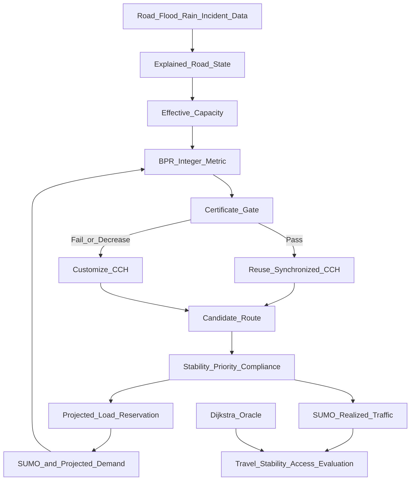

# Certificate-Gated Dynamic Routing under Compound Urban Disruptions

**A reproducible Chennai-oriented research framework**  
**Research and implementation status:** Stage 1 and the preliminary routing-method experiment are implemented; Chennai-wide flood, traffic, and SUMO evaluation remains planned.  
**Evidence reviewed through:** 6 September 2026

## 1. Problem Statement

Road conditions in Chennai can change during monsoon flooding, incidents, and congestion. A road may remain physically connected while losing speed or capacity; redirected vehicles may then overload the remaining alternatives. Recomputing every route after every small update is expensive, but using stale road costs for too long can produce poor routes.

The research problem is:

> How can a routing system update many Chennai vehicle routes under changing flood, incident, and traffic conditions while controlling computation, route error, unnecessary switching, and congestion created by the recommendations themselves?

The system uses a fixed directed road graph with edge costs that change between routing epochs. This is **snapshot-dynamic routing**, not formal time-dependent routing unless edge cost becomes a function of edge-entry time inside one query.

## 2. Objective

Develop and evaluate a reproducible framework that:

1. maps Chennai road, flood, rainfall, incident, and traffic evidence to explainable road states;
2. represents disruption through road availability and effective capacity;
3. converts flow and capacity into travel time using the BPR model;
4. uses Customizable Contraction Hierarchies (CCH) for repeated shortest-path queries;
5. avoids unnecessary CCH metric refreshes with a bounded-staleness certificate;
6. controls route changes using minimum-degradation, minimum-gain, and cooldown rules;
7. includes projected rerouting demand before assigning further routes;
8. evaluates critical-facility access, population-weighted loss, partial compliance, and an emergency scenario; and
9. compares all outcomes with Dijkstra and other justified baselines.

## 3. Expected Outcome

The expected outcome is an evaluated research prototype—not an operational navigation service. It should establish:

- whether certificate-gated synchronization reduces CCH refresh work without violating its declared route-quality bound;
- when CCH is preferable to repeated Dijkstra for the observed query/update workload;
- whether stability and projected-load controls reduce route churn and detour congestion;
- how compound disruption changes access to hospitals, fire stations, and relief centres;
- how benefits change under incomplete guidance compliance and uncertain data; and
- which conclusions are supported only by synthetic experiments versus Chennai evidence.

## 4. Research Gap and Contribution

### 4.1 Novelty Verdict

The project does **not** introduce a new shortest-path algorithm or a new approximation-certificate principle.

The following are established:

- Dijkstra, A*, ALT, CCH, CATCHUp, LPA*, and D* Lite;
- BPR travel-time functions and capacity reduction;
- flood-aware routing and flood–SUMO coupling;
- dynamic rerouting thresholds, bounded rationality, and cooldown;
- projected-load or route-reservation routing;
- emergency priority;
- lower-bound/upper-bound certificates for bounded-suboptimal paths.

The strongest defensible contribution is:

> A reproducible Chennai-oriented compound-disruption framework that applies an established monotone lower/upper-bound certificate as a query-level CCH refresh gate, and is designed to experimentally separate routing-index performance from the traffic effects of stable, projected-load-aware route adoption.

**Novelty confidence: Medium for integration/evaluation; Low for algorithmic novelty.**

### 4.2 Closest Prior Art

| Existing work | What already exists | Remaining difference |
|---|---|---|
| [Bono et al., CPD-Search, IJCAI 2019](https://doi.org/10.24963/ijcai.2019/167) | Old shortest distance as a lower bound, old path re-evaluated as an upper bound under increasing costs | Uses a compressed path database and A* repair, not a CCH refresh gate |
| [Aine and Likhachev, 2016](https://doi.org/10.1016/j.artint.2016.01.009) | Truncated incremental repair with bounded suboptimality | Query-specific incremental search, not batched CCH customization |
| [Dibbelt et al., CCH, 2016](https://doi.org/10.1145/2886843) | Metric-independent preprocessing, customization, fast exact queries, partial propagation | No per-query certificate for deferring refresh |
| [Buchhold et al., 2019](https://doi.org/10.1145/3362693) | CCH with BPR traffic assignment and batched queries | No flood state, stability controller, or certificate gate |
| [Chan et al., 2023](https://doi.org/10.1145/3579842) | CCH customization/query costs, recheck periods, improvement thresholds, compliance/penetration, and congestion redistribution | No flood evidence or deterministic monotone per-query stale-metric certificate |
| [CERT-FLOW, 2026 preprint](https://doi.org/10.31224/7306) | Implemented proof-gated CH/oracle routing under drifting costs | Probabilistic conformal bounds and dual search, not the deterministic monotone specialization |
| [Li et al., 2026](https://doi.org/10.1007/s13753-026-00697-y) | Hydrodynamic flooding, SUMO, rerouting, and emergency vehicles | No CCH certificate or explicit projected-load/stability evaluation |
| [Pan et al., 2012](https://doi.org/10.1109/DCOSS.2012.29) | Proactive projected vehicle footprints and sequential rerouting | No flood evidence or CCH |

No “first certificate,” “first CCH traffic assignment,” or “first flood-aware Chennai router” claim is supportable.

### 4.3 Chennai-Specific Gap

Chennai work already includes:

- crowdsourced flooded-street mapping ([Naik, 2016](https://doi.org/10.1109/SysEng.2016.7753186));
- flood-relief vehicle routing ([Ganguly and Roy, 2017](https://doi.org/10.1109/ICT-DM.2017.8275694));
- city-level Dijkstra/A*/ALT routing ([Kumar et al., 2020](https://doi.org/10.18520/cs/v119/i4/680-690));
- flood forecasting through C-FLOWS ([publisher PDF](https://currentscience.ac.in/Volumes/117/05/0741.pdf));
- flood susceptibility mapping ([Alabdan et al., 2025](https://doi.org/10.1038/s41598-025-08912-4));
- SUMO calibration for heterogeneous Chennai traffic ([Sashank et al., 2020](https://doi.org/10.1007/978-981-15-3742-4_13));
- Chennai BPR-family calibration ([Gore, Arkatkar, Joshi, and Antoniou, 2023](https://doi.org/10.1177/03611981221138511)); and
- a recent flood/traffic/safety navigation concept ([2026 paper](https://doi.org/10.47392/IRJAEH.2026.0595)).

No verified Chennai study was found that jointly evaluates flood-dependent effective capacity, CCH refresh behavior, projected route load, route stability, partial compliance, and population-weighted critical-facility access. This is an evidence-based search result, not proof of universal absence.

### 4.4 Publication Positioning

The paper should be positioned as an **integration, systems, and experimental evaluation paper**. The certificate is an established principle specialized to CCH synchronization. Publication strength depends on:

- transparent Chennai data provenance;
- calibrated or sensitivity-tested capacity assumptions;
- native CCH versus Dijkstra workload benchmarks;
- SUMO outcome evaluation;
- ablations isolating the certificate, CCH, stability, projected load, and priority;
- public experiment configurations and negative results.

### 4.5 Historical Data and Publication Validity

The absence of a public live Chennai traffic/closure feed does not prevent publication. The study must be framed as a **retrospective historical-event replay with simulated traffic**, not an operational live deployment.

Historical evidence can strengthen reproducibility because every method is evaluated against the same dated event. The evaluation will:

1. replay documented Chennai flood conditions and rainfall for declared dates;
2. preserve source versions, retrieval dates, checksums, and spatial resolution;
3. separate model calibration/sensitivity from held-out scenario evaluation;
4. inject controlled 0/30/60/120-minute evidence lags and false-positive/false-negative road states;
5. use repeated SUMO seeds and report confidence intervals;
6. compare historical-evidence routing with perfect-information and no-flood baselines; and
7. describe the architecture as **designed for near-real-time operation**, not as a validated near-real-time or live Chennai service.

The limitation is reduced operational external validity: the study cannot prove present-day live accuracy or deployment readiness. That limitation is acceptable for an applied methods/case-study paper when stated explicitly.

## 5. Proposed Method

### 5.1 Network and Cost Model

Let \(G=(V,E)\) be a fixed directed multigraph. Every edge has:

- free-flow time \(t^0_e\);
- baseline capacity \(c^0_e\);
- assigned entering demand \(x_{e,t}\);
- flood multiplier \(m^{flood}_{e,t}\);
- incident multiplier \(m^{incident}_{e,t}\); and
- source timestamp/confidence.

Effective capacity is:

\[
c^{eff}_{e,t}=
\begin{cases}
0,&\text{verified closure},\\
\max(c^{min}_e,c^0_e m^{flood}_{e,t}m^{incident}_{e,t}),&\text{otherwise}.
\end{cases}
\]

The BPR route cost is:

\[
t_{e,t}=t^0_e\left[
1+\alpha_e\left(
\frac{x_{e,t}}{c^{eff}_{e,t}}
\right)^{\beta_e}
\right],
\]

where adjacency denotes multiplication. For software and CCH, seconds are quantized to non-negative integer milliseconds. Flow and capacity use the same interval and units. Discharged throughput is retained as an outcome, not substituted for assigned entering demand.

When \(c^{eff}_{e,t}=0\), the edge is excluded and its routing cost is \(+\infty\); the finite BPR expression is not evaluated. The native CCH experiment currently rejects closures until a finite sentinel and overflow bound are validated.

### 5.2 Which Algorithm Finds the Path?

**CCH finds the proposed path.** It preprocesses fixed topology once, customizes integer edge weights when the metric changes, and then answers exact shortest-path queries for that represented metric.

- **Dijkstra:** correctness oracle and baseline.
- **ALT-guided bidirectional A\*:** lightweight backup/comparator.
- **Certificate gate:** decides whether CCH must be refreshed; it is not a path-finding replacement.

The repository now contains:

- `RoutingKitCCHEngine`: native experimental CCH adapter;
- `NetworkXDijkstraEngine`: exact reference adapter;
- `CertifiedLazySynchronizer`: certificate and refresh controller;
- `EagerRefreshRouter`: repeated-refresh baseline.

### 5.3 Certified Lazy Synchronization

Let:

- \(\bar w\): the edge metric currently synchronized into CCH;
- \(w\): the latest authoritative/projected metric;
- \(P_0\): an exact path returned under \(\bar w\);
- \(L=d_{\bar w}(s,t)\): its old optimal distance;
- \(U=C_w(P_0)\): the same keyed-edge path evaluated under current weights; and
- \(\epsilon\): permitted represented-cost stretch.

When every current edge weight is at least its synchronized value:

\[
w_e\ge \bar w_e \quad \forall e,
\]

the old optimum is a current lower bound. The route can be returned without CCH customization when:

\[
U\le(1+\epsilon)L.
\]

Otherwise, the controller customizes CCH with the complete current metric and queries again.

#### Three-Road Example

Assume three parallel roads:

| Road | Synchronized cost |
|---|---:|
| A | 5.0 min |
| B | 6.0 min |
| C | 8.0 min |

CCH selects Road A and records \(L=5.0\).

With \(\epsilon=5\%\):

- projected demand raises A to 5.2 min;
- allowed cost is \(1.05\times5.0=5.25\);
- \(5.2\le5.25\), so A is certified and CCH is not refreshed.

If A rises to 5.8 min:

- \(5.8>5.25\);
- the certificate fails;
- CCH is customized with A=5.8, B=6.0, C=8.0 and queries again.

If A rises to 7.0 min, refreshed CCH selects B at 6.0 min.

### 5.4 Formal Guarantee

**Assumptions:** fixed topology, complete atomic metric snapshots, non-negative integer represented weights, exact synchronized-engine query, and pointwise nondecreasing current weights.

For every path \(P\), \(C_{\bar w}(P)\le C_w(P)\). Therefore:

\[
L=d_{\bar w}(s,t)\le d_w(s,t).
\]

Because \(P_0\) remains feasible:

\[
d_w(s,t)\le U=C_w(P_0).
\]

If \(U\le(1+\epsilon)L\), then:

\[
U\le(1+\epsilon)L\le(1+\epsilon)d_w(s,t).
\]

Thus the returned path is within \(1+\epsilon\) of the current represented optimum.

This is an application of an established upper/lower-bound certificate, not a new theorem.

### 5.5 Mandatory Refresh Conditions

The lower bound is invalid if any current weight drops below the synchronized weight. The implementation refreshes before querying after:

- flood or incident recovery;
- capacity increase;
- road reopening;
- any other represented cost decrease.

A closure represented as an increase is safe for the lower-bound direction, but a candidate containing the closed edge fails the upper-bound test. Native CCH currently accepts finite integer weights only; closure-sentinel behavior still requires a dedicated validation stage.

### 5.6 Route Adoption and Projected Load

The certificate controls **metric synchronization**. A separate policy controls **whether a vehicle changes route**:

1. current route becomes infeasible, or degradation exceeds \(\theta_{deg}\);
2. candidate improvement exceeds \(\theta_{gain}\);
3. cooldown has expired unless safety requires immediate action;
4. accepted compliant demand is reserved on projected edge-entry intervals;
5. later requests use the updated projected metric.

This greedy policy is not claimed to achieve traffic equilibrium.

### 5.7 Emergency and Public-Service Evaluation

Emergency routing remains a secondary scenario:

- blocked roads remain forbidden;
- emergency deadline/arrival time receives priority;
- delay imposed on ordinary traffic is reported;
- no signal preemption or live ambulance tracking is claimed.

Five committed evaluation studies strengthen impact without becoming route weights:

1. **Evidence freshness and uncertainty:** controlled lag and classification-error traces.
2. **Critical-facility accessibility:** travel time/disconnection to hospitals, fire stations, and relief centres.
3. **Population-weighted access loss:** distribution of access impact using WorldPop/ward weights; this is not socioeconomic equity.
4. **Partial compliance:** exact seeded cohorts of 0%, 25%, 50%, 75%, and 100% of vehicles follow guidance.
5. **Facility-oriented criticality:** rank directed keyed arcs by newly disconnected population and population-weighted added facility travel time; group both directions/parallel arcs by OSM way ID before physical-road reporting.

Generic deterministic implementations for all five are present in `evaluation/metrics.py` and `evaluation/robustness.py`; Chennai data integration remains a later stage.

## 6. Dataset and Data Access

### 6.1 OpenStreetMap

**Purpose:** Directed Chennai road topology and road attributes.  
**Contains:** Nodes, ways, geometry, road class, direction, and incomplete lanes/speeds/turn data.  
**Chennai coverage:** Yes; completeness must be audited.  
**Global coverage:** Yes.  
**Access:** OSMnx/Overpass or dated Geofabrik extract.

**Limitations:** Mutable community data; missing attributes and turn restrictions.  
**Direct access:** [Geofabrik India](https://download.geofabrik.de/asia/india.html)  
**Documentation:** [OSM licence](https://www.openstreetmap.org/copyright)  
**Repository:** [OSMnx](https://github.com/gboeing/osmnx)  
**Viewer:** [Chennai map](https://www.openstreetmap.org/#map=11/13.083/80.271)

### 6.2 OpenCity Chennai Flood Data

**Purpose:** Historical flood evidence and susceptibility validation.  
**Contains:** The 2015 dataset has hotspots/stagnation points and a 2015 inundation zone; the separate Chennai Flooding Data collection has inundation points/depth and return-period hazards.  
**Chennai coverage:** Direct.  
**Global coverage:** No.  
**Access:** Public CKAN resource download in KML.

**Limitations:** Historical/modelled evidence is not a current road closure.  
**Direct access:** [Chennai Floods 2015](https://data.opencity.in/dataset/chennai-floods-2015-data), [Chennai Flooding Data](https://data.opencity.in/dataset/chennai-flooding-data)  
**Documentation:** [CKAN API metadata](https://data.opencity.in/api/3/action/package_show?id=chennai-floods-2015-data)  
**Repository:** [`flood.py`](../src/chennai_routing/data/flood.py)  
**Viewer:** Resource previews on the OpenCity page.

### 6.3 NASA GPM IMERG

**Purpose:** Historical and delayed near-current rainfall forcing.  
**Contains:** Half-hourly satellite precipitation in Early, Late, and Final runs.  
**Chennai coverage:** Yes, at approximately 0.1° cells.  
**Global coverage:** Near-global.  
**Access:** Free Earthdata/GES DISC account and product download/subset services.

**Limitations:** Approximately 10 km cells; rainfall does not prove street flooding.  
**Direct access:** [IMERG directory](https://gpm.nasa.gov/data/directory)  
**Documentation:** [IMERG V07](https://gpm.nasa.gov/resources/documents/imerg-v07-technical-documentation)  
**Repository:** Planned rainfall module in `src/chennai_routing/data/rainfall.py`  
**Viewer:** [NASA Giovanni](https://giovanni.gsfc.nasa.gov/giovanni/)

If no Earthdata credentials are available, the no-key [Open-Meteo Historical Weather API](https://open-meteo.com/en/docs/historical-weather-api) provides an ERA5/ERA5-Land-derived rainfall fallback. It must be labelled reanalysis and must not be presented as road-level observation.

### 6.4 NASA SRTM/NASADEM and Chennai Hydrology

**Purpose:** Static flood-susceptibility context.  
**Contains:** Approximately 30 m elevation plus separate drain, canal, river, and water-body vectors.  
**Chennai coverage:** Yes.  
**Global coverage:** Terrain is broad/global; OpenCity hydrology is Chennai-specific.  
**Access:** Free Earthdata login and public OpenCity downloads.

**Limitations:** Terrain is not road-level flood depth; drain maps do not prove capacity or maintenance.  
**Direct access:** [SRTMGL1](https://www.earthdata.nasa.gov/data/catalog/lpcloud-srtmgl1-003)  
**Documentation:** [OpenCity drains](https://data.opencity.in/dataset/chennai-stormwater-drain-swd-maps)  
**Repository:** `src/chennai_routing/data/elevation.py`, `hydrology.py`  
**Viewer:** [Earthdata Search](https://search.earthdata.nasa.gov/search?q=SRTMGL1)

### 6.5 Eclipse SUMO

**Purpose:** Dynamic traffic, queues, incidents, vehicle classes, and realized outcomes.  
**Contains:** Software-generated vehicle/edge simulation output—not observed Chennai traffic.  
**Chennai coverage:** User-constructed from the project graph and demand.  
**Global coverage:** User-defined.  
**Access:** Free open-source installation and TraCI/libsumo.

**Limitations:** Requires Chennai demand/behaviour calibration.  
**Direct access:** [SUMO](https://eclipse.dev/sumo/)  
**Documentation:** [SUMO documentation](https://eclipse.dev/sumo/docs/)  
**Repository:** [Eclipse SUMO](https://github.com/eclipse-sumo/sumo)  
**Viewer:** SUMO-GUI, not a web data viewer.

### 6.6 Critical Facilities and Population

**Purpose:** Evaluate public-service accessibility and population-weighted impact.  
**Contains:** Health-centre/fire-station/relief-centre locations and modelled population counts.  
**Chennai coverage:** Direct for OpenCity facilities; WorldPop covers Chennai.  
**Global coverage:** WorldPop is global; facility catalogues are local.  
**Access:** Public OpenCity downloads and HDX/WorldPop raster download.

**Limitations:** Health centres are not necessarily trauma hospitals; population exposure is not socioeconomic equity.  
**Direct access:** [Health centres](https://data.opencity.in/dataset/chennai-healthcare-uphcs-and-uchcs), [fire stations](https://data.opencity.in/dataset/chennai-fire-stations-), [relief centres](https://data.opencity.in/dataset/gcc-relief-centres)  
**Documentation:** [WorldPop India 2015–2030](https://data.humdata.org/dataset/worldpop-population-counts-2015-2030-ind)  
**Repository:** `src/chennai_routing/evaluation/metrics.py`  
**Viewer:** OpenCity resource previews where provided.

## 7. Data Classification and Temporal Meaning

| Source | Classification | Historical/current meaning |
|---|---|---|
| OSM | Primary input | Mutable map snapshot |
| OpenCity flood | Historical evidence | Past observation/modelled hazard |
| SRTM/NASADEM | Supporting input | Static 2000-era terrain |
| IMERG Early | Primary dynamic input | Delayed satellite rainfall estimate |
| IMERG Final | Calibration input | Historical gauge-adjusted rainfall |
| SUMO | Experimental generator | Simulated traffic |
| Facility data | Evaluation input | Catalogue snapshot |
| WorldPop | Evaluation input | Modelled population |
| Processed edge metric | Derived dataset | Project calculation with version/time |

Optional OpenWeather/Open-Meteo forecasts may support demonstrations, but the core does not depend on paid APIs. No verified public live Chennai road-speed, accident, signal, or closure API is assumed.

## 8. Data-to-Routing Mapping

| Raw source | Derived factor | Model effect | Routing effect |
|---|---|---|---|
| OSM | Topology, free-flow time, capacity assumption | Base graph | Feasible paths/lower cost |
| Flood history + terrain + drains | Susceptibility | Static prior | Modifies rainfall response |
| IMERG | Rolling rainfall | Road-state evidence | Capacity/availability update |
| Verified closure/incident | Edge state | Capacity zero/reduction | Remove/raise edge cost |
| Assigned SUMO demand | PCE/time entering flow | BPR \(x/c\) | Metric update |
| Accepted compliant routes | Projected edge-entry load | Future BPR metric | Reduces herding |
| Facilities + population | Access outcomes | Evaluation only | No arbitrary route penalty |

## 9. Architecture



## 10. Implementation Status and Revised Stages

### Stage 1 — Historical Flood Closure Proof of Concept

**Status:** Implemented.  
OSM and OpenCity historical hotspots are joined to roads; one real mapped edge is controlled as blocked; BPR weights and two Dijkstra snapshots demonstrate closure avoidance. Finite congestion response is not validated.

### Stage 2 — Certificate and Routing-Engine Validation

**Status:** Implemented as a synthetic preliminary experiment.

- engine-neutral complete metric snapshots;
- exact NetworkX Dijkstra engine;
- native `routingkit-cch` 0.1.4 engine;
- keyed-edge path extraction;
- integer metric and atomic updates;
- bounded-staleness certificate;
- mandatory refresh after lower-bound invalidation;
- eager baseline and deterministic experiment runner;
- accessibility/compliance evaluation utilities;
- uncertainty and facility-road-criticality utilities;
- 41 passing tests.

### Stage 3 — Reproducible Chennai Graph

**Status:** Planned.  
Dated OSM extract, stable arc IDs, validated directions/turns/parallel arcs, free-flow times, and documented capacity assumptions.

### Stage 4 — Flood and Road-State Evidence

**Status:** Generic lag/error perturbation implemented; Chennai evidence integration planned.  
Historical susceptibility, IMERG or no-key reanalysis rainfall, optional current evidence, source freshness, confidence, and explained `NORMAL/DEGRADED/SEVERE/BLOCKED` states.

### Stage 5 — Chennai Traffic and SUMO Calibration

**Status:** Planned.  
Heterogeneous demand, entering PCE flow, incidents, queues, BPR calibration/sensitivity, and no double counting of SUMO delay.

### Stage 6 — Chennai CCH Integration

**Status:** Planned.  
Geometry-aware ordering, turn-expanded topology, finite closure sentinel, integer quantization, full/partial customization, and Dijkstra differential validation.

### Stage 7 — Stable Projected-Load Rerouting

**Status:** Planned.  
Threshold, minimum gain, cooldown, time-indexed route reservations, and compliance sensitivity.

### Stage 8 — Accessibility, Population, Compliance, and Road Criticality

**Status:** Generic metrics implemented; Chennai data integration planned.  
Hospitals, fire stations, relief centres, disconnection, p90 access, population-weighted loss, partial compliance, and facility-oriented road criticality.

### Stage 9 — Emergency Scenario

**Status:** Planned.  
Response time, deadline success, safety exposure, and ordinary-user external delay.

### Stage 10 — Full Evaluation and Paper

**Status:** Preliminary method evidence available; Chennai/SUMO evidence pending.  
Paired scenarios, baselines, ablations, uncertainty, statistical reporting, reproducibility package, and final manuscript.

## 11. Preliminary Certificate Experiment

### 11.1 Setup

- seeded synthetic directed multigraph;
- 200 nodes plus 600 additional arcs;
- 100 update epochs;
- 5 edge updates and 50 OD queries per epoch;
- 5% certificate tolerance;
- identical trace for Dijkstra and CCH;
- monotone-increase and mixed increase/decrease workloads;
- Python 3.12.3, NetworkX 3.6.1, `routingkit-cch` 0.1.4.

### 11.2 Main Results

| Engine/workload | Queries | Certified stale | Lazy refreshes | Eager update refreshes | Avoided | Bound violations | Lazy total | Eager total |
|---|---:|---:|---:|---:|---:|---:|---:|---:|
| Dijkstra/increases | 5,000 | 4,840 | 6 | 100 | 94 | 0 | 587 ms | 705 ms |
| Dijkstra/mixed | 5,000 | 700 | 86 | 100 | 14 | 0 | 707 ms | 736 ms |
| CCH/increases | 5,000 | 4,840 | 6 | 100 | 94 | 0 | 120 ms | 203 ms |
| CCH/mixed | 5,000 | 700 | 86 | 100 | 14 | 0 | 209 ms | 202 ms |

There were zero certificate violations, zero exact post-refresh mismatches, and zero CCH-versus-independent-Dijkstra oracle mismatches. The monotone workload produced the largest reduction because the lower bound remained valid. Mixed decreases correctly forced frequent refreshes; in this single run, lazy CCH was slightly slower than eager CCH.

These are one-machine, single-run synthetic measurements with degree ordering. “Total” uses symmetric wall-clock boundaries for all post-initialization updates and route requests. Engine construction is reported separately; synchronization diagnostics combine initial and later synchronizations and should not be added to “Total.” The values validate implementation behavior, not Chennai travel outcomes or general performance.

### 11.3 Epsilon Sensitivity

For 2,500 CCH queries over 50 monotone epochs, refreshes fell from 33 at 0% tolerance to 25 at 1%, 4 at 5%, and 0 at 10%, with zero observed bound violations. Under mixed updates, decreases dominated: refreshes were 47, 44, 43, and 43 respectively.

Machine-readable results are stored in [`docs/evidence/CERTIFIED_LAZY_SYNC_RESULTS.json`](evidence/CERTIFIED_LAZY_SYNC_RESULTS.json).

## 12. Evaluation Plan

### Baselines

1. route-once Dijkstra;
2. eager repeated Dijkstra;
3. eager CCH;
4. certificate-gated CCH;
5. ALT-guided bidirectional A*;
6. SUMO periodic rerouting;
7. independent versus projected-load-aware assignments.

### Ablations

- no flood evidence;
- no certificate;
- no threshold/cooldown;
- no projected reservations;
- no emergency priority;
- no population weighting;
- compliance levels 0–100%.

### Metrics

| Metric | Purpose |
|---|---|
| Certificate violation and optimality gap | Method correctness |
| Preprocess/customize/query/unpack/epoch latency | Routing feasibility |
| Travel time, person-delay, queue, spillback | Traffic outcomes |
| Reroute count and reversals | Stability |
| Maximum \(x/c\) and load concentration | Herding |
| Blocked/severe-edge exposure | Safety |
| Facility travel-time p50/p90 and disconnection | Public-service access |
| Population-weighted access loss | Distributional impact |
| Emergency deadline success and normal-user delay | Priority trade-off |
| Lag/error sensitivity | Data uncertainty |

## 13. Reproducibility

```bash
python -m venv .venv
source .venv/bin/activate
python -m pip install -e ".[test,cch]"
python -m pytest
python scripts/run_certified_lazy_experiment.py \
  --engine both --mode both --seed 8597 \
  --nodes 200 --extra-edges 600 \
  --epochs 100 --updates-per-epoch 5 \
  --queries-per-epoch 50 --epsilon-percent 5
```

Stage 1:

```bash
python scripts/run_stage1_poc.py
```

Remote OSM/OpenCity inputs remain mutable until dated snapshots and checksums are committed. Synthetic experiment results are deterministic apart from timing.

## 14. Feasibility and Remaining Uncertainty

**Available:** OSM, OpenCity, IMERG, SRTM/NASADEM, facility catalogues, WorldPop, SUMO, NetworkX, native CCH binding, and tested Python controller.

**Uncertain/optional:** public live Chennai speeds, machine-readable closures/incidents, signal-controller data, ambulance AVL, street-level satellite flood depth, and facility capacity.

The core remains feasible using historical replay and labelled simulation without paid APIs.

## 15. Limitations

1. The certificate principle has close prior art; algorithmic novelty is not claimed.
2. Preliminary experiments are synthetic and do not establish Chennai outcomes.
3. Native CCH uses degree ordering; production Chennai ordering is unvalidated.
4. CCH closure sentinel, turns, and quantization require further tests.
5. Any weight decrease invalidates the stale lower bound and usually forces refresh.
6. The certificate controls represented route cost, not model accuracy.
7. BPR parameters and flood-capacity multipliers are not Chennai-calibrated.
8. BPR does not represent queue spillback; SUMO must measure it.
9. Historical flood observations are not live closures.
10. IMERG is coarse and delayed relative to streets.
11. SUMO demand is simulated and requires local calibration.
12. Population exposure is not socioeconomic equity.
13. Facility catalogues do not provide capacity or guaranteed emergency capability.
14. Partial compliance is a sensitivity assumption, not observed behaviour.
15. Projected greedy reservations do not guarantee equilibrium.
16. A literature audit cannot prove universal novelty.

## 16. Final Project Summary

| Component | Final decision |
|---|---|
| Problem | Repeated routing under compound flood, incident, and congestion updates |
| Path engine | Native CCH; Dijkstra correctness baseline; ALT backup |
| Certificate | Established LB/UB principle used as a CCH refresh gate |
| Defensible novelty | Chennai integration, workload characterization, and compound-disruption evaluation |
| Flood model | Susceptibility + rainfall + optional observation → explained state |
| Traffic model | BPR route estimate + SUMO realized outcome |
| Stability | Trigger, minimum gain, cooldown, projected time-indexed load |
| Additional factors | Uncertainty, facility access, population-weighted loss, partial compliance, road criticality |
| Emergency | Secondary scenario with external-delay reporting |
| Current evidence | Stage 1 plus tested synthetic CCH/Dijkstra method experiment |
| Required next evidence | Chennai graph, flood/rain pipeline, SUMO calibration and full ablations |

## 17. Research Claim Boundary

The completed implementation supports this statement:

> On deterministic synthetic fixed-topology workloads, the implemented monotone metric certificate returned routes within its declared represented-cost bound, matched exact routing after refresh, and reduced eager metric refreshes for both Dijkstra and CCH adapters.

It does **not yet** support:

- improved Chennai travel time or emergency response;
- operational real-time flood routing;
- a new shortest-path algorithm;
- a new approximation-certificate theorem;
- city-scale CCH performance;
- publication-ready causal claims.

Those claims require completion of Stages 3–10.
