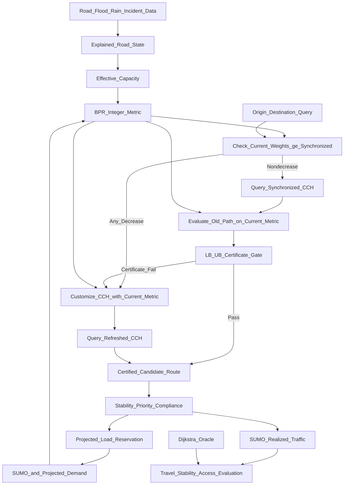

# Certificate-Gated Dynamic Routing under Compound Urban Disruptions

## Abstract

This work implements and audits a Chennai-oriented routing framework that joins a reproducible dated OpenStreetMap road graph, historical flood evidence, scenario road-state overlays, an integer-metric Customizable Contraction Hierarchy (CCH), certificate-gated metric refresh, projected-load reservations, public-facility accessibility, and an emergency-priority policy. The regenerated graph contains 155,345 nodes and 331,545 directed arcs; two independent builds produced identical sorted node- and arc-ID digests. On 24 city-graph differential queries, unpacked CCH costs matched Dijkstra exactly. A historical-hotspot-conditioned blockage scenario disconnected about 9,965 of 3.59 million represented WorldPop residents (0.277%) in the accessibility projection. Synthetic four-node reservation experiments showed no improvement at 25% or 50% compliance, but lower mean BPR travel time at 75% and 100%; a paired emergency scenario reduced arrival time by 60 seconds while adding 15 seconds of ordinary-user external delay. These are integration and functional-evaluation results, not a calibrated 2015 flood reconstruction or operational Chennai traffic outcomes. Most OSM speeds and lanes are missing and replaced only by labelled scenario defaults; matched citywide SUMO scenarios and several planned ablations remain unexecuted. The contribution is therefore the reproducible integration and evidence discipline, with an established route-cost certificate used as a CCH refresh gate - not a new shortest-path algorithm.

## 1. Problem Statement

Road conditions in Chennai can change during monsoon flooding, incidents, and congestion. A road may remain physically connected while losing speed or capacity; redirected vehicles may then overload the remaining alternatives. Recomputing every route after every small update is expensive, but using stale road costs for too long can produce poor routes.

The research problem is:

> How can a routing system update many Chennai vehicle routes under changing flood, incident, and traffic conditions while controlling computation, route error, unnecessary switching, and congestion created by the recommendations themselves?

The system uses a fixed directed road graph with edge costs that change between routing epochs. This is **snapshot-dynamic routing**, not formal time-dependent routing unless edge cost becomes a function of edge-entry time inside one query.

## 2. Objective

Develop and evaluate a reproducible framework that:

1. maps Chennai road, flood, rainfall, incident, and traffic evidence to explainable road states;
2. represents disruption through road availability and effective capacity;
3. converts flow and capacity into travel time using the BPR model;
4. uses Customizable Contraction Hierarchies (CCH) for repeated shortest-path queries;
5. avoids unnecessary CCH metric refreshes with a bounded-staleness certificate;
6. controls route changes using minimum-degradation, minimum-gain, and cooldown rules;
7. includes projected rerouting demand before assigning further routes;
8. evaluates critical-facility access, population-weighted loss, partial compliance, and an emergency scenario; and
9. compares all outcomes with Dijkstra and other justified baselines.

## 3. Expected Outcome

The expected outcome is an evaluated research prototype—not an operational navigation service. It should establish:

- whether certificate-gated synchronization reduces CCH refresh work without violating its declared route-quality bound;
- when CCH is preferable to repeated Dijkstra for the observed query/update workload;
- whether stability and projected-load controls reduce route churn and detour congestion;
- how compound disruption changes access to hospitals, fire stations, and relief centres;
- how benefits change under incomplete guidance compliance and uncertain data; and
- which conclusions are supported only by synthetic experiments versus Chennai evidence.

## 4. Research Gap and Contribution

### 4.1 Novelty Verdict

The project does **not** introduce a new shortest-path algorithm or a new approximation-certificate principle.

The following are established:

- Dijkstra, A*, ALT, CCH, CATCHUp, LPA*, and D* Lite;
- BPR travel-time functions and capacity reduction;
- flood-aware routing and flood–SUMO coupling;
- dynamic rerouting thresholds, bounded rationality, and cooldown;
- projected-load or route-reservation routing;
- emergency priority;
- lower-bound/upper-bound certificates for bounded-suboptimal paths.

The strongest defensible contribution is:

> A reproducible Chennai-oriented compound-disruption framework that applies an established monotone lower/upper-bound certificate as a query-level CCH refresh gate, and is designed to experimentally separate routing-index performance from the traffic effects of stable, projected-load-aware route adoption.

**Provisional novelty assessment:** Medium for the proposed integration/evaluation and Low for algorithmic novelty, pending a systematic database search and completed Chennai experiments.

### 4.2 Closest Prior Art

| Existing work | What already exists | Remaining difference |
|---|---|---|
| [Bono et al., CPD-Search, IJCAI 2019](https://doi.org/10.24963/ijcai.2019/167) | Old shortest distance as a lower bound, old path re-evaluated as an upper bound under increasing costs | Uses a compressed path database and A* repair, not a CCH refresh gate |
| [Aine and Likhachev, 2016](https://doi.org/10.1016/j.artint.2016.01.009) | Truncated incremental repair with bounded suboptimality | Query-specific incremental search, not batched CCH customization |
| [Dibbelt et al., CCH, 2016](https://doi.org/10.1145/2886843) | Metric-independent preprocessing, customization, fast exact queries, partial propagation | No per-query certificate for deferring refresh |
| [Buchhold et al., 2019](https://doi.org/10.1145/3362693) | CCH with BPR traffic assignment and batched queries | No flood state, stability controller, or certificate gate |
| [Chan et al., 2023](https://doi.org/10.1145/3579842) | Metropolitan-scale Mobiliti simulation of dynamic rerouting penetration, recheck periods, improvement thresholds, congestion redistribution, and parallel scalability | No flood evidence or deterministic monotone per-query stale-metric certificate; not a CCH study |
| [CERT-FLOW, 2026 preprint](https://doi.org/10.31224/7306) | Implemented proof-gated CH/oracle routing under drifting costs | Probabilistic conformal bounds and dual search, not the deterministic monotone specialization |
| [Li et al., 2026](https://doi.org/10.1007/s13753-026-00697-y) | Hydrodynamic flooding, SUMO, rerouting, and emergency vehicles | No CCH certificate or explicit projected-load/stability evaluation |
| [Pan et al., 2012](https://doi.org/10.1109/DCOSS.2012.29) | Proactive projected vehicle footprints and sequential rerouting | No flood evidence or CCH |

No “first certificate,” “first CCH traffic assignment,” or “first flood-aware Chennai router” claim is supportable.

#### Search Protocol and Limit

The audit used targeted English-language searches through 6 September 2026 across scholarly web indexes, DOI/publisher records, surveys, reference chains, and Google Patents. Search concepts included `CCH dynamic rerouting`, `lazy/partial customization`, `stale metric shortest path certificate`, `monotone edge-weight increase`, `bounded suboptimal replanning`, `BPR route reservation`, `flood SUMO routing`, and `Chennai flood routing`. Candidate work was screened for certificate logic, routing index, traffic assignment, flood evidence, stability, and emergency/accessibility evaluation.

This was a focused prior-art audit, not a registered systematic review. The claimed gap is therefore provisional and must be rechecked using venue-specific databases and documented inclusion/exclusion counts before submission.

### 4.3 Chennai-Specific Gap

Chennai work already includes:

- crowdsourced flooded-street mapping ([Naik, 2016](https://doi.org/10.1109/SysEng.2016.7753186));
- flood-relief vehicle routing ([Ganguly and Roy, 2017](https://doi.org/10.1109/ICT-DM.2017.8275694));
- city-level Dijkstra/A*/ALT routing ([Bachu et al., 2020](https://doi.org/10.18520/cs/v119/i4/680-690));
- flood forecasting through C-FLOWS ([publisher PDF](https://currentscience.ac.in/Volumes/117/05/0741.pdf));
- flood susceptibility mapping ([Alabdan et al., 2025](https://doi.org/10.1038/s41598-025-08912-4));
- SUMO calibration for heterogeneous Chennai traffic ([Sashank et al., 2020](https://doi.org/10.1007/978-981-15-3742-4_13));
- Chennai BPR-family calibration ([Gore, Arkatkar, Joshi, and Antoniou, 2023](https://doi.org/10.1177/03611981221138511)); and
- a recent flood/traffic/safety navigation concept ([2026 paper](https://doi.org/10.47392/IRJAEH.2026.0595)).

No verified Chennai study was found that jointly evaluates flood-dependent effective capacity, CCH refresh behavior, projected route load, route stability, partial compliance, and population-weighted critical-facility access. This is an evidence-based search result, not proof of universal absence.

### 4.4 Publication Positioning

The paper should be positioned as an **integration, systems, and experimental evaluation paper**. The certificate is an established principle specialized to CCH synchronization. Publication strength depends on:

- transparent Chennai data provenance;
- calibrated or sensitivity-tested capacity assumptions;
- native CCH versus Dijkstra workload benchmarks;
- SUMO outcome evaluation;
- ablations isolating the certificate, CCH, stability, projected load, and priority;
- public experiment configurations and negative results.

### 4.5 Historical Data and Publication Validity

The absence of a public live Chennai traffic/closure feed does not by itself preclude a retrospective methods submission; suitability depends on validation quality and venue. The study must be framed as a **retrospective historical-evidence-conditioned simulation/scenario reconstruction**, not an observed road-state replay or operational live deployment.

Historical evidence can strengthen reproducibility because every method is evaluated against the same dated event. The evaluation will:

1. condition scenarios on documented Chennai flood evidence and rainfall for declared dates;
2. preserve source versions, retrieval dates, checksums, and spatial resolution;
3. separate model calibration/sensitivity from held-out scenario evaluation;
4. inject controlled 0/30/60/120-minute lags and false-positive/false-negative states into derived/simulated road-state traces;
5. use repeated SUMO seeds and report confidence intervals;
6. compare historical-evidence routing with perfect-information and no-flood baselines; and
7. describe the architecture as **designed for near-real-time operation**, not as a validated near-real-time or live Chennai service.

OpenCity hotspot/hazard layers do not provide authoritative timestamped road-state trajectories. Until such observations are obtained, lag/error tests measure robustness to controlled assumptions rather than empirical sensing accuracy. The study cannot prove present-day live accuracy or deployment readiness.

## 5. Proposed Method

### 5.1 Network and Cost Model

Let \(G=(V,E)\) be a fixed directed multigraph. Every edge has:

- free-flow time \(t^0_e\);
- baseline capacity \(c^0_e\);
- assigned entering demand \(x_{e,t}\);
- flood multiplier \(m^{flood}_{e,t}\);
- incident multiplier \(m^{incident}_{e,t}\); and
- source timestamp/confidence.

Effective capacity is:

\[
c^{eff}_{e,t}=
\begin{cases}
0,&\text{verified closure},\\
\max(c^{min}_e,c^0_e m^{flood}_{e,t}m^{incident}_{e,t}),&\text{otherwise}.
\end{cases}
\]

The BPR route cost is:

\[
t_{e,t}=t^0_e\left[
1+\alpha_e\left(
\frac{x_{e,t}}{c^{eff}_{e,t}}
\right)^{\beta_e}
\right],
\]

where adjacency denotes multiplication. For software and CCH, seconds are quantized to non-negative integer milliseconds. Flow and capacity use the same interval and units. Discharged throughput is retained as an outcome, not substituted for assigned entering demand.

When \(c^{eff}_{e,t}=0\), the edge is excluded and its routing cost is \(+\infty\); the finite BPR expression is not evaluated. Native CCH currently rejects \(+\infty\) closures; Dijkstra omits those edges. An integer-millisecond conversion is implemented for the Stage 2 snapshot glue.

### 5.2 Which Algorithm Finds the Path?

Stage 1 uses Dijkstra. Stage 2 can select Dijkstra or the native CCH adapter on synthetic graphs. Stage 6 validates the Chennai topology conversion, finite closure handling, quantization, inertial ordering, customization, unpacking, and path equality; turn restrictions remain unavailable and are explicitly excluded from the validated claim.

- **Dijkstra:** implemented correctness oracle and Stage 1 baseline.
- **CCH:** implemented and validated against Dijkstra on sampled city-graph queries, subject to the stated turn-restriction limitation.
- **ALT-guided bidirectional A\*:** not implemented and excluded from the executed comparison matrix.
- **Certificate gate:** decides whether CCH must be refreshed; it is not a path-finding replacement.

The repository now contains:

- `RoutingKitCCHEngine`: native experimental CCH adapter;
- `NetworkXDijkstraEngine`: exact reference adapter;
- `CertifiedLazySynchronizer`: certificate and refresh controller;
- `EagerRefreshRouter`: repeated-refresh baseline.

### 5.3 Certified Lazy Synchronization

Let:

- \(\bar w\): the edge metric currently synchronized into CCH;
- \(w\): the latest authoritative/projected metric;
- \(P_0\): an exact path returned under \(\bar w\);
- \(L=d_{\bar w}(s,t)\): its old optimal distance;
- \(U=C_w(P_0)\): the same keyed-edge path evaluated under current weights; and
- \(\epsilon\): permitted represented-cost stretch.

When every current edge weight is at least its synchronized value:

\[
w_e\ge \bar w_e \quad \forall e,
\]

the old optimum is a current lower bound. The route can be returned without CCH customization when:

\[
U\le(1+\epsilon)L.
\]

Otherwise, the controller customizes CCH with the complete current metric and queries again.

#### Three-Road Example

Assume three parallel roads:

| Road | Synchronized cost |
|---|---:|
| A | 5.0 min |
| B | 6.0 min |
| C | 8.0 min |

CCH selects Road A and records \(L=5.0\).

With \(\epsilon=5\%\):

- projected demand raises A to 5.2 min;
- allowed cost is \(1.05\times5.0=5.25\);
- \(5.2\le5.25\), so A is certified and CCH is not refreshed.

If A rises to 5.8 min:

- \(5.8>5.25\);
- the certificate fails;
- CCH is customized with A=5.8, B=6.0, C=8.0 and queries again.

If A rises to 7.0 min, refreshed CCH selects B at 6.0 min.

### 5.4 Formal Guarantee

**Assumptions:** fixed topology, complete atomic metric snapshots, non-negative integer represented weights, exact synchronized-engine query, and pointwise nondecreasing current weights.

For every path \(P\), \(C_{\bar w}(P)\le C_w(P)\). Therefore:

\[
L=d_{\bar w}(s,t)\le d_w(s,t).
\]

Because \(P_0\) remains feasible:

\[
d_w(s,t)\le U=C_w(P_0).
\]

If \(U\le(1+\epsilon)L\), then:

\[
U\le(1+\epsilon)L\le(1+\epsilon)d_w(s,t).
\]

Thus the returned path is within \(1+\epsilon\) of the current represented optimum.

This is an application of an established upper/lower-bound certificate, not a new theorem.

### 5.5 Mandatory Refresh Conditions

The lower bound is invalid if any current weight drops below the synchronized weight. The implementation refreshes before querying after:

- flood or incident recovery;
- capacity increase;
- road reopening;
- any other represented cost decrease.

A closure represented as an increase is safe for the lower-bound direction, but a candidate containing the closed edge fails the upper-bound test. Native CCH accepts finite integer weights only, so Stage 6 validates a finite closure sentinel against the configured maximum finite path-weight bound; it does not support literal \(+\infty\) inside CCH.

### 5.6 Route Adoption and Projected Load

The certificate controls **metric synchronization**. A separate SCENARIO filter can then decide **whether a vehicle changes route**:

1. current route becomes infeasible, or degradation exceeds \(\theta_{deg}\);
2. candidate improvement exceeds \(\theta_{gain}\);
3. cooldown has expired unless safety requires immediate action.

Items 1–3 are implemented as `decide_route_adoption`. Stage 7 also implements time-binned, compliant-only projected-load reservations with metric updates applied before certificate evaluation. The reservation experiment is limited to a four-node labelled SCENARIO network and is not claimed to achieve traffic equilibrium or a fleet optimum.

### 5.7 Emergency and Public-Service Evaluation

Emergency routing remains a secondary scenario:

- blocked roads remain forbidden;
- emergency deadline/arrival time receives priority;
- delay imposed on ordinary traffic is reported;
- no signal preemption or live ambulance tracking is claimed.

Five committed evaluation studies strengthen impact without becoming route weights:

1. **Evidence freshness and uncertainty:** controlled lag and classification-error traces.
2. **Critical-facility accessibility:** travel time/disconnection to hospitals, fire stations, and relief centres.
3. **Population-weighted access loss:** distribution of access impact using WorldPop/ward weights; this is not socioeconomic equity.
4. **Partial compliance:** nearest-integer seeded cohorts target 0%, 25%, 50%, 75%, and 100%; exact percentages require a compatible fleet size.
5. **Facility-oriented criticality:** rank directed keyed arcs by newly disconnected population and unnormalised person-time added to facility access; group both directions/parallel arcs by OSM way ID before physical-road reporting.

The dated Chennai graph, WorldPop raster, UPHC/UCHC catalogues, and fire-station catalogue were integrated in Stage 8. Population-weighted accessibility, seeded compliance cohorts, directed-arc dependency exposure, and OSM-way grouping were executed. Relief centres were excluded for lack of verified coordinates, and controlled lag/classification-error traces remain utility-level rather than a matched city experiment.

## 6. Dataset and Data Access

### 6.1 Factor-to-Data, Credential, and Implementation Matrix

| Factor | Required data | Chennai source | Access method | API key/account | No-credential path | Implemented now | Remaining experiment work |
|---|---|---|---|---|---|---|---|
| Evidence freshness and uncertainty | A derived/simulated road-state trace plus rainfall/flood evidence | [OpenCity flood records](https://data.opencity.in/dataset/chennai-floods-2015-data); ERA5 reanalysis; optional [IMERG Final V07](https://disc.gsfc.nasa.gov/datasets/GPM_3IMERGHH_07/summary) | CKAN download, HTTPS reanalysis download, or credentialed GES DISC download | **No key** for executed OpenCity/ERA5 path; Earthdata account for optional IMERG | OpenCity + ERA5 | Historical-evidence-conditioned Stage 4 state table; generic lag/error utilities | Obtain timestamped road observations and execute matched lag/error scenarios |
| Critical-facility accessibility | Geolocated health, fire, and relief facilities | OpenCity [health](https://data.opencity.in/dataset/chennai-healthcare-uphcs-and-uchcs), [fire](https://data.opencity.in/dataset/chennai-fire-stations-), and [relief](https://data.opencity.in/dataset/gcc-relief-centres) | Coordinate-bearing KML and relief-centre PDF | **No key or account** | Use verified coordinate-bearing KML | 140 UPHC, 14 UCHC, and 47 fire stations verified, snapped, and evaluated | Add verified hospital capability/capacity; geocode and manually verify relief centres |
| Population impact | Population count raster | Exact [2015 India 1 km R2025A STAC item](https://api.stac.worldpop.org/collections/IND/items/ind_pop_2015_CN_1km_R2025A_UA_v1) | Public STAC asset/GeoTIFF download | **No key or account** | Use the 1 km 2015 asset to match the historical scenario | 525 graph origins representing 3,591,253 residents evaluated | Validate sub-cell allocation and compare weighted versus unweighted outcomes |
| Partial compliance | Vehicle IDs and declared compliance level; no observed compliance dataset | [SUMO automatic-routing options](https://eclipse.dev/sumo/docs/Demand/Automatic_Routing.html) | Local policy/SUMO configuration | **No key or account** | Seeded cohort; size is \(\lfloor np+0.5\rfloor\) | 0/25/50/75/100% seeded Stage 7 scenario cohorts executed | Execute matched citywide SUMO comparator with calibrated demand and repeated stochastic seeds |
| Facility-oriented criticality | Chennai graph + facilities + population; no separate dataset | Derived from [OSM](https://www.openstreetmap.org/), OpenCity facilities, and WorldPop | Local reverse multi-source shortest-path analysis | **No additional key or account** | Reuse the three public inputs above | Chennai-scale directed-arc dependency ranking and OSM-way grouping executed | Recompute causal closure criticality for physical roads and validate candidate interpretation |

**Feasibility conclusion:** the no-credential Chennai pipeline was demonstrated for dated topology, historical/modelled flood evidence, ERA5 reanalysis, coarse public elevation, coordinate-bearing facilities, and WorldPop. Optional official NASA IMERG/SRTM inputs still require credentials; relief-centre coordinates and operational facility capability remain unverified.

### 6.2 API and Authentication Checklist

| Source/service | Cost for research core | Key required? | Account required? | Access/authentication detail | Important restriction |
|---|---|---:|---:|---|---|
| [OpenCity Chennai](https://data.opencity.in/) | Free public data | No | No | Dataset page and CKAN resource download | Resources vary between CSV, KML, and PDF; validate dates/schema |
| [Public OSM Overpass](https://wiki.openstreetmap.org/wiki/Overpass_API) | Free community service | No | No | `https://overpass-api.de/api/interpreter`; use caching and a descriptive user agent | Rate/size limits; dated extracts are preferable for reproducibility |
| [Geofabrik India OSM extract](https://download.geofabrik.de/asia/india.html) | Free public download | No | No | Download dated `.osm.pbf`; a separate importer is required | India-wide file is large; ODbL attribution applies |
| [Open-Meteo Historical Weather API](https://open-meteo.com/en/docs/historical-weather-api) | Free for rate-limited non-commercial use | No | No | `https://archive-api.open-meteo.com/v1/archive` returns JSON | CC BY 4.0 attribution; 600 calls/min, 5,000/hour, 10,000/day, 300,000/month; no uptime guarantee |
| [NASA GPM IMERG/GES DISC](https://github.com/nasa/gesdisc-tutorials/blob/main/notebooks/How_to_Access_GES_DISC_Data_Using_Python.ipynb) | Free | No conventional key | **Yes** | Authorize NASA GES DISC and use Earthdata credentials or `Authorization: Bearer <token>` | Optional because the user must create/maintain the account/token |
| [WorldPop India 2015 1 km STAC item](https://api.stac.worldpop.org/collections/IND/items/ind_pop_2015_CN_1km_R2025A_UA_v1) | Free public download | No | No | Select the GeoTIFF asset from the fixed item ID; do not discover by `datetime` alone | R2025A is model-derived/alpha; verify version and pixel-count conservation |
| [Eclipse SUMO/TraCI](https://eclipse.dev/sumo/) | Free open-source software | No | No | Local installation and Python/TraCI interface | Output is simulation, not observed traffic |
| [RoutingKit CCH](https://pypi.org/project/routingkit-cch/) | Free open-source package | No | No | Install `routingkit-cch` Python package | Native finite-integer/turn/closure assumptions require validation |

No secret, password, or bearer token is committed to the repository.

### 6.3 OpenStreetMap

**Purpose:** Directed Chennai road topology and road attributes.  
**Contains:** Nodes, ways, geometry, road class, direction, and incomplete lanes/speeds/turn data.  
**Chennai coverage:** Yes; completeness must be audited.  
**Global coverage:** Yes.  
**Access:** OSMnx/Overpass or dated Geofabrik extract.

**Limitations:** Mutable community data; missing attributes and turn restrictions.  
**Direct access:** [Geofabrik India](https://download.geofabrik.de/asia/india.html)  
**Documentation:** [OSM licence](https://www.openstreetmap.org/copyright), [Overpass API policy](https://wiki.openstreetmap.org/wiki/Overpass_API)  
**Repository:** [OSMnx](https://github.com/gboeing/osmnx)  
**Viewer:** [Chennai map](https://www.openstreetmap.org/#map=11/13.083/80.271)

The facility query will be sent to `https://overpass-api.de/api/interpreter`, cached with retrieval time/checksum, and limited to the declared Chennai study boundary. A descriptive User-Agent is mandatory. The research job will use one non-parallel request, avoid large repeated queries, and treat the public instance as best-effort with no SLA.

```text
[out:json][timeout:120];
(
  nwr["amenity"~"^(hospital|clinic|fire_station)$"](12.85,80.05,13.25,80.40);
  nwr["social_facility"="shelter"](12.85,80.05,13.25,80.40);
);
out center tags;
```

The bounding box is a provisional acquisition envelope and must be replaced by the final Stage 3 study boundary. `social_facility=shelter` is exploratory OSM tagging and must not be equated with an activated GCC relief centre. The official GCC PDF remains authoritative for the declared 2024 list.

Relief-address geocoding will follow the [Nominatim usage policy](https://operations.osmfoundation.org/policies/nominatim/): maximum one request/second, one thread on one machine, valid identifying User-Agent, local caching, attribution, and no recurring bulk job. Coordinates/names will be manually verified; unverified entries will be excluded.

### 6.4 OpenCity Chennai Flood Data

**Purpose:** Historical flood evidence and susceptibility validation.  
**Contains:** The 2015 dataset has hotspots/stagnation points and a 2015 inundation zone; the separate Chennai Flooding Data collection has inundation points/depth and return-period hazards.  
**Chennai coverage:** Direct.  
**Global coverage:** No.  
**Access:** Public CKAN resource download in KML.

**Limitations:** Historical/modelled evidence is not a current road closure.  
**Direct access:** [Chennai Floods 2015](https://data.opencity.in/dataset/chennai-floods-2015-data), [Chennai Flooding Data](https://data.opencity.in/dataset/chennai-flooding-data)  
**Documentation:** [CKAN API metadata](https://data.opencity.in/api/3/action/package_show?id=chennai-floods-2015-data)  
**Repository:** [`flood.py`](../src/chennai_routing/data/flood.py)  
**Viewer:** Resource previews on the OpenCity page.

### 6.5 NASA GPM IMERG

**Purpose:** Historical and delayed near-current rainfall forcing.  
**Contains:** Half-hourly satellite precipitation; historical evaluation selects Final V07 collection `GPM_3IMERGHH_07`.  
**Chennai coverage:** Yes, at approximately 0.1° cells.  
**Global coverage:** Near-global.  
**Access:** Free Earthdata account, NASA GES DISC application authorization, and `.netrc` credentials or bearer-token authentication.

**Limitations:** Approximately 10 km cells; rainfall does not prove street flooding.  
**Direct access:** [GPM_3IMERGHH_07 summary](https://disc.gsfc.nasa.gov/datasets/GPM_3IMERGHH_07/summary)  
**Documentation:** [IMERG V07](https://gpm.nasa.gov/resources/documents/imerg-v07-technical-documentation), [DOI 10.5067/GPM/IMERG/3B-HH/07](https://doi.org/10.5067/GPM/IMERG/3B-HH/07)  
**Repository:** `src/chennai_routing/data/rainfall.py` implements the executed reanalysis acquisition/provenance path; credentialed IMERG acquisition remains optional and unexecuted.
**Viewer:** [NASA Giovanni](https://giovanni.gsfc.nasa.gov/giovanni/)

If no Earthdata credentials are available, the no-key [Open-Meteo Historical Weather API](https://open-meteo.com/en/docs/historical-weather-api) provides an ERA5-derived fallback. A [tested Chennai request](https://archive-api.open-meteo.com/v1/archive?latitude=13.0827&longitude=80.2707&start_date=2015-11-01&end_date=2015-11-02&hourly=precipitation&models=era5&timezone=Asia%2FKolkata) uses `latitude=13.0827`, `longitude=80.2707`, declared dates, `hourly=precipitation`, `models=era5`, and `timezone=Asia/Kolkata`. It must be labelled retrospective reanalysis—not contemporaneous sensing or road-level observation.

### 6.6 NASA SRTM/NASADEM and Chennai Hydrology

**Purpose:** Static flood-susceptibility context.  
**Contains:** Approximately 30 m elevation plus separate drain, canal, river, and water-body vectors.  
**Chennai coverage:** Yes.  
**Global coverage:** Terrain is broad/global; OpenCity hydrology is Chennai-specific.  
**Access:** Free Earthdata login and public OpenCity downloads.

**Limitations:** Terrain is not road-level flood depth; drain maps do not prove capacity or maintenance.  
**Direct access:** [SRTMGL1](https://www.earthdata.nasa.gov/data/catalog/lpcloud-srtmgl1-003)  
**Documentation:** [OpenCity drains](https://data.opencity.in/dataset/chennai-stormwater-drain-swd-maps)  
**Repository:** `src/chennai_routing/data/elevation.py` and `hydrology.py` implement the executed coarse-elevation and public hydrology evidence path.
**Viewer:** [Earthdata Search](https://search.earthdata.nasa.gov/search?q=SRTMGL1)

### 6.7 Eclipse SUMO

**Purpose:** Dynamic traffic, queues, incidents, vehicle classes, and realized outcomes.  
**Contains:** Software-generated vehicle/edge simulation output—not observed Chennai traffic.  
**Chennai coverage:** User-constructed from the project graph and demand.  
**Global coverage:** User-defined.  
**Access:** Free open-source installation and TraCI/libsumo.

**Limitations:** Requires Chennai demand/behaviour calibration.  
**Direct access:** [SUMO](https://eclipse.dev/sumo/)  
**Documentation:** [SUMO documentation](https://eclipse.dev/sumo/docs/), [automatic-routing/compliance options](https://eclipse.dev/sumo/docs/Demand/Automatic_Routing.html)  
**Repository:** [Eclipse SUMO](https://github.com/eclipse-sumo/sumo)  
**Viewer:** SUMO-GUI, not a web data viewer.

### 6.8 Critical Facilities and Population

**Purpose:** Evaluate public-service accessibility and population-weighted impact.  
**Contains:** Health-centre CSV/selected KML, fire-station CSV/KML, a 2024 relief-centre PDF, and modelled population counts.  
**Chennai coverage:** Direct for OpenCity facilities; WorldPop covers Chennai.  
**Global coverage:** WorldPop is global; facility catalogues are local.  
**Access:** Public OpenCity downloads and the fixed WorldPop STAC item/GeoTIFF asset.

**Limitations:** UPHC/UCHC data is not a comprehensive emergency-hospital inventory; the relief PDF does not provide validated graph-ready coordinates or current activation; population exposure is not socioeconomic equity.  
**Direct access:** [Health metadata/API](https://data.opencity.in/api/3/action/package_show?id=chennai-healthcare-uphcs-and-uchcs), [fire metadata/API](https://data.opencity.in/api/3/action/package_show?id=chennai-fire-stations-), [relief metadata/API](https://data.opencity.in/api/3/action/package_show?id=gcc-relief-centres), [WorldPop 2015 India 1 km item](https://api.stac.worldpop.org/collections/IND/items/ind_pop_2015_CN_1km_R2025A_UA_v1), [15.48 MB GeoTIFF asset](https://data.worldpop.org/GIS/Population/Global_2015_2030/R2025A/2015/IND/v1/1km_ua/constrained/ind_pop_2015_CN_1km_R2025A_UA_v1.tif)  
**Documentation:** [WorldPop 1 km dataset DOI](https://doi.org/10.5258/SOTON/WP00840), [WorldPop STAC](https://api.stac.worldpop.org)  
**Repository:** `src/chennai_routing/stage8_accessibility.py` implements streamed graph loading, facility/population snapping, sparse accessibility, and dependency reporting; reusable summaries remain in `evaluation/metrics.py`.
**Viewer:** OpenCity resource previews and [WorldPop STAC Browser](https://stac.worldpop.org/).

Selected OpenCity resources were downloaded and verified on 6 September 2026:

| Selected resource | CKAN resource ID | Format/size | SHA-256 |
|---|---|---:|---|
| [UPHC map](https://data.opencity.in/dataset/e08b7485-40ab-4401-861f-f790ed8e5328/resource/5a81427f-0aa1-4270-8df4-5d4cef250912/download/a33b403b-f341-4214-8613-88e2ec227359.kml) | `5a81427f-0aa1-4270-8df4-5d4cef250912` | KML, 100,497 B | `a700d7e837a5466d38e99a6ed1b67a2ff27be9638605f77b5051fef3b85055eb` |
| [UCHC map](https://data.opencity.in/dataset/e08b7485-40ab-4401-861f-f790ed8e5328/resource/cd4effee-997f-4fe0-b376-8801080c6962/download/a604ea86-6bed-45ab-89cf-074fb5a59bfc.kml) | `cd4effee-997f-4fe0-b376-8801080c6962` | KML, 14,155 B | `45e31b7dc026f54dd4e03191c2b91278a9722af5ace5425ebeb44de5c1c637ed` |
| [Fire-station locations](https://data.opencity.in/dataset/ea5bb2ae-3fa7-46cd-8af6-9e8da42810bb/resource/39d3601b-cd42-4c11-a6c3-8fc4b057b38a/download/9097a4c9-cd79-4df1-8552-1c67f280ede3.kml) | `39d3601b-cd42-4c11-a6c3-8fc4b057b38a` | KML, 13,664 B | `f41a5afb44e316aea26403f8403b08e14fcac9f13c2d5947d3e5ba859736dad9` |
| [GCC 2024 relief-centre list](https://data.opencity.in/dataset/df93544a-b5b8-445e-b29f-cf6a5a24dfa7/resource/ee9f087a-dc6c-41fa-8810-954a9f5887ac/download/23cf4489-bcb9-4f34-b69c-f99e1cedd296.pdf) | `ee9f087a-dc6c-41fa-8810-954a9f5887ac` | PDF, 247,507 B | `9d68bb27098d81b161badb721a12d7cd36ba5e856a6a033590876b61cf16ac57` |

These resources identify primary/community health centres, fire stations, and a relief-centre list; they do not establish trauma capability, facility capacity, opening status, or emergency readiness.

## 7. Data Classification and Temporal Meaning

| Source | Classification | Historical/current meaning |
|---|---|---|
| OSM | Primary input | Mutable map snapshot |
| OpenCity flood | Historical evidence | Past observation/modelled hazard |
| SRTM/NASADEM | Supporting input | Static 2000-era terrain |
| Open-Meteo ERA5 | No-key core rainfall input | Retrospective reanalysis, not contemporaneous sensing |
| IMERG Final | Optional credentialed calibration input | Historical gauge-adjusted satellite rainfall |
| IMERG Early | Optional credentialed near-current input | Delayed satellite rainfall estimate |
| SUMO | Experimental generator | Simulated traffic |
| Facility data | Evaluation input | Catalogue snapshot |
| WorldPop | Evaluation input | Modelled population |
| Processed edge metric | Derived dataset | Project calculation with version/time |

Optional forecasts may support demonstrations, but the historical core uses no-key Open-Meteo ERA5 reanalysis and does not depend on paid APIs. No verified public live Chennai road-speed, accident, signal, or closure API is assumed.

## 8. Data-to-Routing Mapping

| Raw source | Derived factor | Model effect | Routing effect |
|---|---|---|---|
| OSM | Topology, free-flow time, capacity assumption | Base graph | Feasible paths/lower cost |
| Flood history + terrain + drains | Susceptibility | Static prior | Modifies rainfall response |
| Open-Meteo ERA5 or optional IMERG | Rolling rainfall | Scenario-conditioning evidence | Capacity/availability assumption |
| Verified closure/incident | Edge state | Capacity zero/reduction | Remove/raise edge cost |
| Assigned SUMO demand | PCE/time entering flow | BPR \(x/c\) | Metric update |
| Accepted compliant routes | Projected edge-entry load | Future BPR metric | Reduces herding |
| Facilities + population | Access outcomes | Evaluation only | No arbitrary route penalty |

## 9. Architecture



Implemented now: dated Chennai graph and historical-evidence ingestion; explained road states; integer BPR snapshot glue; Dijkstra/CCH engines and certificate gate; SUMO network import with synthetic demand; projected-load reservations; WorldPop/facility accessibility; and deterministic emergency policy. Matched citywide SUMO outcomes and several Stage 10 ablations remain unexecuted.

## 10. Implementation Status and Revised Stages

### Stage 1 — Dated Historical-Hotspot Scenario Demonstration

**Status:** PASS WITH LIMITATIONS.
A documented extract of the dated Stage 3 graph, route CSV, PNG, and evidence manifest are versioned. Blocking one Stage 4 historical-hotspot arc increased the represented route cost from 9.916 to 18.687 seconds. The blockage and uniform 1200/600 capacity-flow values are SCENARIO inputs, not calibration.

### Stage 2 — Certificate and Routing-Engine Validation

**Status:** PASS as synthetic functional evidence; rerun under Python 3.11.16.

- engine-neutral complete metric snapshots;
- exact NetworkX Dijkstra engine;
- native `routingkit-cch` 0.1.4 engine;
- keyed-edge path extraction;
- integer metric and atomic updates;
- bounded-staleness certificate;
- mandatory refresh after lower-bound invalidation;
- eager baseline and deterministic experiment runner;
- accessibility/compliance evaluation utilities;
- uncertainty and facility-road-criticality utilities;
- zero certificate, exact-refresh, and engine-oracle mismatches in the committed sweep.

### Stage 3 — Reproducible Chennai Graph

**Status:** PASS WITH REPORTED ATTRIBUTE MISSINGNESS.
The pinned Geofabrik India extract passed provider MD5 verification. The GCC-clipped graph has 155,345 nodes, 331,545 arcs, one strong component, no self-loops, and no duplicate stable arc IDs. Two independent builds produced identical sorted node- and arc-ID hashes. Only 6,092 arcs have explicit speeds; 325,453 use no observed speed.

### Stage 4 — Flood and Road-State Evidence

**Status:** PASS WITH LIMITATIONS.
OpenCity flood/drain evidence, ERA5 rainfall, and a public coarse DEM are preserved with provenance. The generated `NORMAL/DEGRADED/SEVERE/BLOCKED` table is a historical-evidence-conditioned scenario, not timestamped road truth or current flooding.

### Stage 5 — Chennai Traffic and SUMO Calibration

**Status:** PASS WITH LIMITATIONS for network import; traffic outcomes remain unexecuted.
Portable Eclipse SUMO 1.27.1 imported all 331,545 Stage 3 arcs through plain node/edge files and generated 60 seeded synthetic trips. Demand, lane defaults, and most speeds are SCENARIO; no Chennai counts or OD matrix were acquired.

### Stage 6 — Chennai CCH Integration

**Status:** PASS WITH LIMITATIONS.
Inertial CCH ordering, exact OSM-to-CCH maps, millisecond quantization, finite closure bound, full/partial customization, and path unpacking are implemented. All 24 city-graph differential queries matched Dijkstra. Turn restrictions are not modelled.

### Stage 7 — Stable Projected-Load Rerouting

**Status:** PASS WITH LIMITATIONS on a four-node SCENARIO network.
Time-binned compliant-only reservations and update-before-certificate ordering are implemented. The matched SUMO periodic comparator is unexecuted; no equilibrium or fleet-optimum claim is made.

### Stage 8 — Accessibility, Population, Compliance, and Road Criticality

**Status:** PASS WITH LIMITATIONS.
Verified UPHC, UCHC, and fire-station catalogues were snapped to a streaming projection of the Stage 3 graph and weighted by 2015 WorldPop. Baseline and historical-hotspot scenario accessibility, connected/all-origin p50/p90 statistics, seeded compliance, directed-arc dependency, and OSM-way grouping are reported. Relief centres were excluded because their coordinates were not independently verified; health centres are not labelled trauma hospitals and population is not equity.

### Stage 9 — Emergency Scenario

**Status:** PASS WITH LIMITATIONS on a paired SCENARIO candidate set.
Safety/feasibility precedes deadline and bounded ordinary-user delay, with deterministic ties. Priority changed arrival by -60 seconds and ordinary-user external delay by +15 seconds in three deterministic seeds. There is no signal pre-emption, live AVL, or operational calibration.

### Stage 10 — Full Evaluation and Paper

**Status:** PARTIAL - publication package with explicit experiment gaps.
The evidence synthesis reports executed and unexecuted baselines/scenarios/ablations, paired-seed intervals, and negative results. Citywide SUMO scenario outcomes, a matched stability ablation, and a matched population-weighting ablation remain unexecuted and are not presented as results.

## 11. Preliminary Certificate Experiment

### 11.1 Setup

- seeded synthetic directed multigraph;
- 200 nodes plus 600 additional arcs;
- 100 update epochs;
- 5 edge updates and 50 OD queries per epoch;
- 5% certificate tolerance;
- identical trace for Dijkstra and CCH;
- monotone-increase and mixed increase/decrease workloads (a changed edge decreases with probability 0.3);
- Python 3.11.16, NetworkX 3.6.1, `routingkit-cch` 0.1.4.

### 11.2 Main Results

| Prototype adapter/workload | Queries | Certified stale | Lazy refreshes | Eager update refreshes | Avoided | Bound violations | Lazy total | Eager total |
|---|---:|---:|---:|---:|---:|---:|---:|---:|
| Dijkstra/increases | 5,000 | 4,840 | 6 | 100 | 94 | 0 | 4,172.1 ms | 4,701.6 ms |
| Dijkstra/mixed | 5,000 | 700 | 86 | 100 | 14 | 0 | 2,185.5 ms | 2,178.4 ms |
| CCH/increases | 5,000 | 4,840 | 6 | 100 | 94 | 0 | 266.0 ms | 429.2 ms |
| CCH/mixed | 5,000 | 700 | 86 | 100 | 14 | 0 | 448.2 ms | 432.5 ms |

There were zero certificate violations, zero exact post-refresh mismatches, and zero CCH-versus-independent-Dijkstra oracle mismatches. The monotone workload produced the largest reduction because the lower bound remained valid. Mixed decreases correctly forced frequent refreshes; in this single run, lazy CCH was slightly slower than eager CCH.

These are one-machine, single-run synthetic prototype-adapter measurements with degree ordering. “Total” uses symmetric wall-clock boundaries for all post-initialization updates and route requests. Engine construction is reported separately; synchronization diagnostics combine initial and later synchronizations and should not be added to “Total.”

The CCH adapter constructs a fresh `CCHMetric` on synchronization and a fresh `CCHQuery` for each request; metric reset, partial/parallel customization, and query reuse are not benchmarked. The eager Dijkstra adapter similarly rebuilds its represented weighted graph. Therefore, these values validate prototype behavior only and do not establish an optimized CCH-versus-Dijkstra break-even point or Chennai performance.

### 11.3 Epsilon Sensitivity

For 2,500 CCH queries over 50 monotone epochs, refreshes fell from 33 at 0% tolerance to 25 at 1%, 4 at 5%, and 0 at 10%, with zero observed bound violations. Under mixed updates, decreases dominated: refreshes were 47, 44, 43, and 43 respectively.

Machine-readable results are stored in [`docs/evidence/CERTIFIED_LAZY_SYNC_RESULTS.json`](evidence/CERTIFIED_LAZY_SYNC_RESULTS.json).

## 12. Evaluation Plan

### Baselines

1. route-once Dijkstra;
2. eager repeated Dijkstra;
3. eager CCH;
4. certificate-gated CCH;
5. ALT-guided bidirectional A*;
6. SUMO periodic rerouting;
7. independent versus projected-load-aware assignments.

### Ablations

- no flood evidence;
- no certificate;
- no threshold/cooldown;
- no projected reservations;
- no emergency priority;
- no population weighting;
- compliance levels 0–100%.

### Metrics

| Metric | Purpose |
|---|---|
| Certificate violation and optimality gap | Method correctness |
| Preprocess/customize/query/unpack/epoch latency | Routing feasibility |
| Travel time, person-delay, queue, spillback | Traffic outcomes |
| Reroute count and reversals | Stability |
| Maximum \(x/c\) and load concentration | Herding |
| Blocked/severe-edge exposure | Safety |
| Facility travel-time p50/p90 and disconnection | Public-service access |
| Population-weighted access loss | Distributional impact |
| Emergency deadline success and normal-user delay | Priority trade-off |
| Lag/error sensitivity | Data uncertainty |

## 13. Reproducibility

```text
python -m pytest
python scripts/run_stage3_boundary.py
python scripts/run_stage3_graph.py
python scripts/check_stage3_reproducibility.py record
python scripts/run_stage3_graph.py
python scripts/check_stage3_reproducibility.py verify
python scripts/run_stage4_road_state.py
python scripts/run_stage5_sumo.py
python scripts/run_stage6_cch.py
python scripts/run_stage7_reservations.py
python scripts/run_stage8_accessibility.py
python scripts/run_stage9_emergency.py
python scripts/run_certified_lazy_sweep.py
python scripts/run_stage10_evaluation.py
```

Stage 1 publication artifacts are regenerated with `python scripts/run_stage1_publication.py`. Raw and processed binaries are ignored; committed JSON manifests record provider URLs, checksums, retrieval times, software versions, classifications, and claim limits. The dated OSM PBF is pinned by provider MD5. Synthetic logical results are deterministic apart from measured timings.

## 14. Feasibility and Remaining Uncertainty

**Public/no-key inputs and tools:** OSM, OpenCity, Open-Meteo reanalysis, facility catalogues, WorldPop, SUMO, NetworkX, native CCH binding, and the tested Python utilities. **Credentialed optional inputs:** official IMERG and SRTM/NASADEM through Earthdata.

**Uncertain/optional:** public live Chennai speeds, machine-readable closures/incidents, signal-controller data, ambulance AVL, street-level satellite flood depth, and facility capacity.

The core is demonstrated as a historical-evidence-conditioned scenario reconstruction using public/no-key inputs. End-to-end topology, state mapping, SUMO network import, city CCH validation, and accessibility have run. Calibrated Chennai demand and full citywide traffic outcomes are not demonstrated.

## 15. Limitations

1. The certificate principle has close prior art; algorithmic novelty is not claimed.
2. Traffic, reservation, and emergency experiments are synthetic and do not establish Chennai operational outcomes.
3. City CCH uses inertial ordering and passed cost differential tests, but timings are single-machine measurements.
4. Turn restrictions are not represented; closures use a proven finite geographic sentinel and quantized milliseconds.
5. Any weight decrease invalidates the stale lower bound and usually forces refresh.
6. The certificate controls represented route cost, not model accuracy.
7. BPR parameters and flood-capacity multipliers are not Chennai-calibrated.
8. BPR does not represent queue spillback; SUMO must measure it.
9. Historical flood observations are not live closures.
10. IMERG is coarse and delayed relative to streets.
11. SUMO demand is synthetic; no matched citywide scenario outcome or local calibration is reported.
12. Population exposure is not socioeconomic equity.
13. Facility catalogues do not provide capacity or guaranteed emergency capability.
14. Partial compliance is a sensitivity assumption, not observed behaviour.
15. Projected greedy reservations do not guarantee equilibrium.
16. A literature audit cannot prove universal novelty.
17. Accessibility and criticality use a least-cost directed-arc projection and modelled WorldPop; dependency ranking is not causal road importance.
18. OpenCity historical layers do not provide authoritative timestamped road-state truth.
19. Stage 1 uniform flow/capacity makes BPR almost a scale factor; congestion response is not validated.
20. The adoption and reservation policies are labelled scenarios, not observed driver behaviour or equilibrium models.
21. Relief-centre addresses were excluded because coordinates were not independently verified.
22. Stage 10 remains partial: matched stability, population-weighting, compound citywide, and SUMO-periodic comparisons are unexecuted.

## 16. Final Project Summary

| Component | Final decision |
|---|---|
| Problem | Repeated routing under compound flood, incident, and congestion updates |
| Path engine | Dijkstra oracle and inertial CCH validated on the 155,345-node Chennai graph; ALT unimplemented and excluded |
| Certificate | Established LB/UB principle used as a CCH refresh gate |
| Defensible novelty | Chennai integration, workload characterization, and compound-disruption evaluation |
| Flood model | Historical OpenCity inventory + rainfall/terrain context -> explained scenario state; not road-state truth |
| Traffic model | BPR route estimate + imported SUMO network; matched SUMO outcomes unexecuted |
| Stability | Trigger, cooldown, and compliant-only time-indexed projected reservations implemented |
| Additional factors | Uncertainty, facility access, population-weighted loss, partial compliance, road criticality |
| Emergency | Secondary scenario with external-delay reporting |
| Current evidence | Dated reproducible graph, road-state overlay, city CCH differential, synthetic reservations/emergency, and population-weighted access |
| Required next evidence | Calibrated demand, matched citywide SUMO scenarios, stability/population ablations, and external validation |

## 17. Research Claim Boundary

The completed implementation supports this statement:

> A reproducible 155,345-node, 331,545-arc Chennai road graph was rebuilt twice with identical node- and arc-ID digests. On that represented integer metric, inertial CCH matched Dijkstra on all 24 sampled differential queries. Public historical/modelled evidence can be mapped to explicit scenario road states and population-weighted facility-access summaries, while synthetic reservation and emergency experiments expose compliance and external-delay trade-offs. The certificate is an established represented-cost CCH refresh gate, not a new shortest-path method.

It does **not** support:

- improved Chennai travel time or emergency response;
- operational real-time flood routing;
- a new shortest-path algorithm;
- a new approximation-certificate theorem;
- calibrated 2015 or current flood depths/closures;
- calibrated Chennai OD demand, queues, spillback, or citywide SUMO outcomes;
- trauma-hospital capability, relief-centre activation, or socioeconomic equity;
- equilibrium, optimal fleet assignment, or causal road-criticality claims;
- completion of every planned Stage 10 comparator and ablation.

The Stage 10 synthesis is a transparent partial publication package. Its defensible novelty is Chennai-oriented integration and reproducibility; remaining gaps are explicit in `docs/evidence/STAGE10_EVALUATION_RESULTS.json`.
